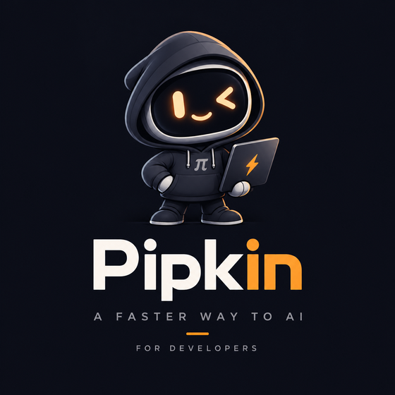
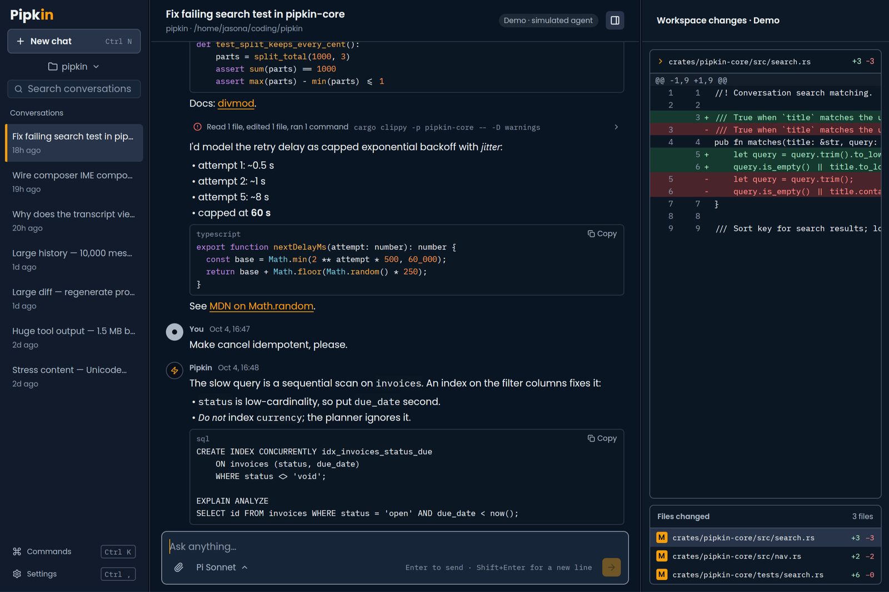
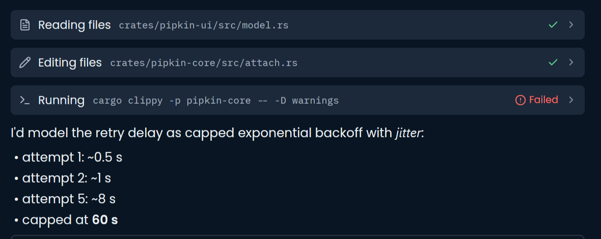
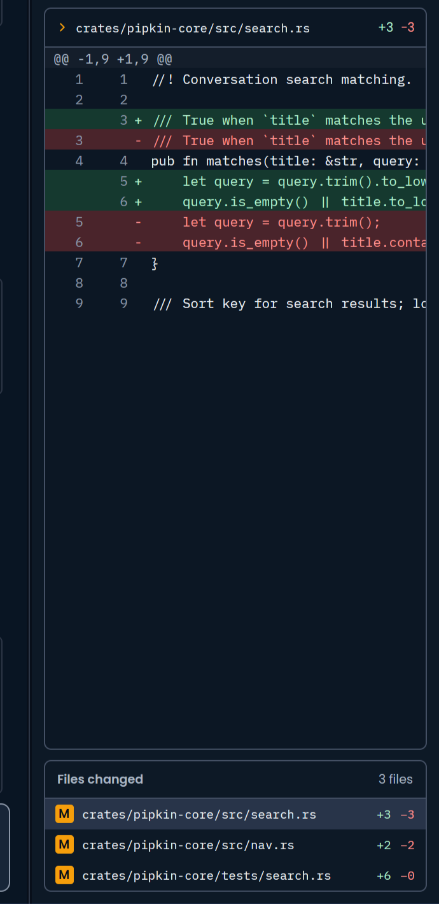
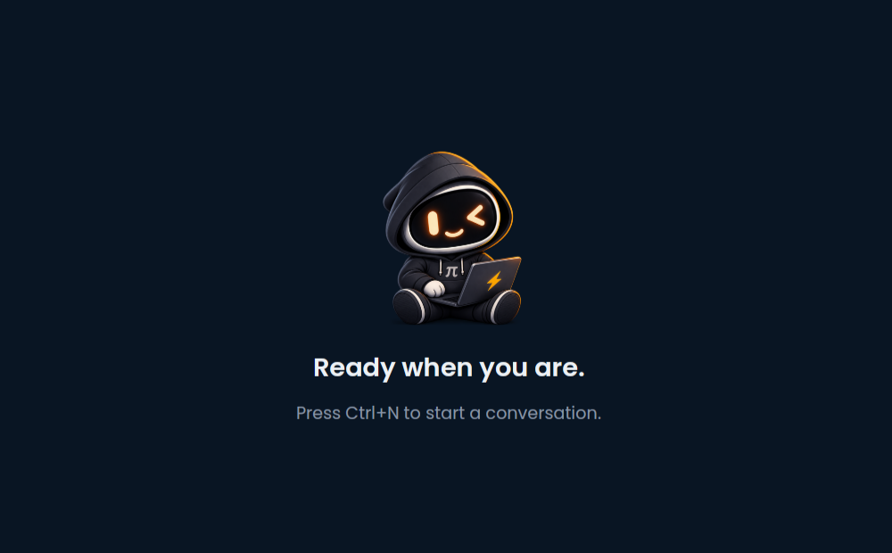
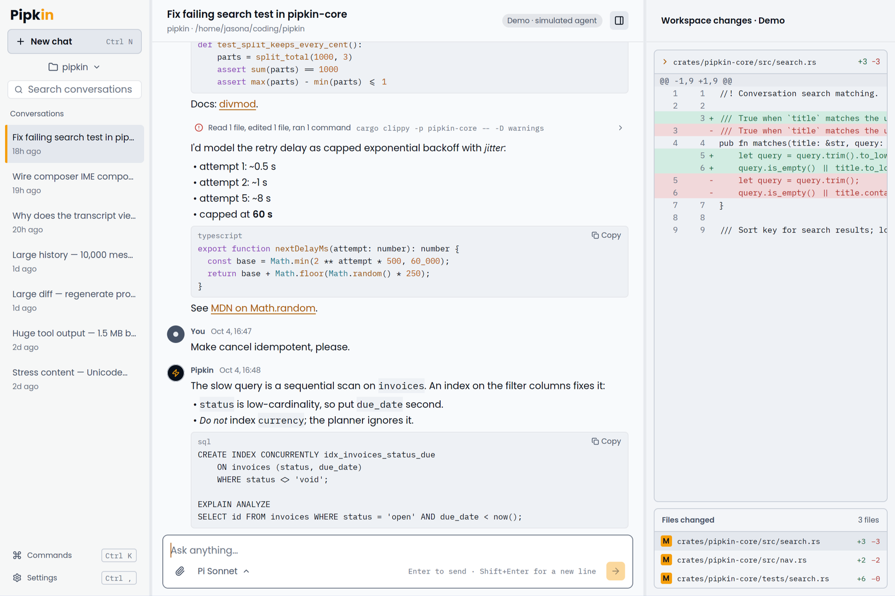
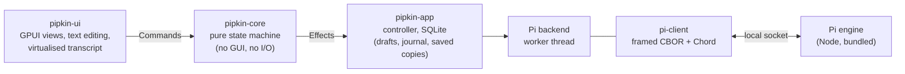

<div align="center">



# Pipkin

**A faster way to AI, for developers.**<br>
A native desktop client for the [Pi](https://github.com/jasona/pi) coding agent, written in Rust with GPUI.


-080F1A?style=flat-square)


<br>



<sub>The window above is the built-in demo (a simulated agent, marked "Demo · simulated agent" in the app).</sub>

</div>

<br>

## Why Pipkin

Pi is a coding agent with a powerful engine. Pipkin gives it a fast, calm, native home: streaming answers,
tool calls you can read at a glance, the diff of every file the agent touched, and a composer that never loses
what you typed. It is a real application, not a web view: one Rust binary, GPU-drawn, with its own text
editing, selection and accessibility tree.

> **Alpha.** Built and used on Arch / Omarchy (Hyprland, Wayland). It runs against a real Pi engine, and the
> install, accessibility and scaling checks that need a person at a machine are only partly done. See
> [Status](#status) before you rely on it.

## Features

**Work with the agent**
- Streaming conversations with Markdown, syntax-highlighted code and one-click copy.
- Tool calls as quiet, slim lines: a plain verb ("Reading files", "Editing files", "Running"), what they act on, and a
  check, spinner or failure. A run of steps folds to one line ("Read 2 files, edited 1 file, ran 3 commands" plus the
  latest command) with a chevron at the end; click it to show every step and follow along live. The model's thinking is
  a one-line summary you can open. Expand any step for its full output, saved or copied in full even when long.
- **Steer** a run in progress, **queue** a follow-up, **stop** it, and pick it back up after a restart. The engine
  owns the queue, so what you see is what will run.
- Attach files by picker or by dropping them on the window; choose the model from the engine's catalog.
- Extensions can ask you questions through dialogs (choices, yes/no, text), with decline and a banner if you put one
  aside.

**See what changed**
- A changes pane with a diff card (line numbers, additions and removals) and a "Files changed" list with
  M / A / D badges and counts.
- Open the selected file in your editor, or a terminal in the project, from the pane.

**Never lose work**
- Drafts are saved as you type; a send is written to a journal *before* it leaves, so a crash or a lost connection
  can never run a prompt twice or drop one silently.
- Conversations are cached on your machine: without the engine they still open, read and search, clearly marked as
  saved copies.
- Search messages across everything saved, and page back through history past a compaction.

**Feels native**
- A brand-true dark theme and a light one, Poppins throughout, text sizes, reduced motion, keyboard-first.
- Remembers your window size and pane widths. Input methods (IME) and a screen-reader tree are supported, and
  tested as far as is listed under [Status](#status).

<table>
  <tr>
    <td width="50%"></td>
    <td width="50%"></td>
  </tr>
  <tr>
    <td align="center"><sub>Tool calls at a glance</sub></td>
    <td align="center"><sub>Every change, with its diff</sub></td>
  </tr>
  <tr>
    <td></td>
    <td></td>
  </tr>
  <tr>
    <td align="center"><sub>Ready when you are</sub></td>
    <td align="center"><sub>Light theme</sub></td>
  </tr>
</table>

## Install

You need a Wayland (or X11) desktop, a Vulkan-capable GPU driver, and **Node.js 22.19 or newer**. Pipkin bundles
the Pi engine, so nothing else has to be installed; your own Pi credentials in `~/.pi/agent` are used as they are.

### Arch / Omarchy

```sh
git clone https://github.com/jasona/pipkin && cd pipkin
cd packaging && makepkg -si          # builds the package and installs it (needs a Pi checkout beside the repo)
pipkin --diagnose --probe            # checks the install and starts a throwaway engine to prove it answers
```

### Any Linux, from a release tarball

```sh
tar --zstd -xf pipkin-<version>-x86_64.tar.zst && ./install.sh     # into ~/.local, no root needed
./install.sh --list            # installed versions
./install.sh --rollback        # go back to the previous version in one step
```

Each version is kept in its own directory with its own engine, so an upgrade never leaves a mismatched pair, and
your drafts and history are never touched. Verify a download with `scripts/verify-release.sh`. Details:
[`docs/packaging.md`](docs/packaging.md).

### From source

```sh
# Rust is pinned by rust-toolchain.toml
cargo run -p pipkin-app --release -- --pi-repo ../pi-fork/pi --pi-agent-dir ~/.pi/agent --project .
```

`--pi-repo` points at a checkout of the Pi engine with its dependencies installed (`npm ci`). Without it (and
without `--pi-dir` / `--pi-server-id`), Pipkin looks for an installed engine, then for a running server.

## Using it

| You want to | Run |
| --- | --- |
| Talk to a real model | `pipkin` (installed), or the `cargo run` line above with your `~/.pi/agent` |
| Try it with no keys and no network | `scripts/try-m2.sh` (a real engine with a scripted offline provider; a prompt containing "slow" holds the run so you can steer, queue and stop it) |
| Look around with fake data | `pipkin --demo normal` (also: `followup`, `failure`, `unknown`, `stressed`, `large`, `persist-fail`) |
| Check an installation | `pipkin --version`, `pipkin --diagnose [--probe]` |
| Open a specific project | `--project DIR` (repeatable; the last one is selected) |
| Use your own editor / terminal | `--editor CMD`, `--terminal CMD` (else `$VISUAL`/`$EDITOR`, `$TERMINAL`) |
| Keep data elsewhere | `--data-dir DIR` |

### Continuous goals

Type `/goal <what to accomplish>` in the composer and press Enter. While Pipkin is open, it keeps the goal attached to that conversation and asks Pi to continue after each completed turn until Pi explicitly reports it met, blocked, or unreachable. `/goal <new goal>` replaces it; `/goal clear` removes it and stops an active goal turn. The goal strip above the composer shows its status and has a clear button.

If Pi does not give an unambiguous status, or a turn fails, Pipkin pauses instead of blindly continuing. Saved goals return paused after a restart so an uncertain turn is never resent automatically; re-enter `/goal <goal>` to resume. In demo mode, replies are simulated and do not execute the goal.

### Keyboard

| | | | |
| --- | --- | --- | --- |
| `Ctrl K` command palette | `Ctrl N` new chat | `Ctrl L` focus composer | `Ctrl J` focus transcript |
| `Enter` send | `Shift Enter` new line | `Ctrl Enter` queue follow-up | `Ctrl Shift Enter` steer the run |
| `Ctrl .` stop the run | `Ctrl M` choose model | `Ctrl O` attach files | `Ctrl Down` jump to latest |
| `Ctrl B` sidebar | `Ctrl I` changes pane | `Alt Up/Down` previous / next chat | `F2` rename chat |
| `Ctrl ,` settings | `Ctrl Shift O` open project | `Esc` close a menu | `Ctrl Q` quit |

## How it works



- **`pipkin-core`** holds every decision (run state, queues, availability, draft and save state) and knows nothing
  about the GUI. Every event from the engine carries `(conversation, generation, operation)` and stale ones are
  dropped.
- **`pipkin-ui`** only renders and turns input into commands. Rendering does no I/O and no parsing.
- **`pipkin-app`** owns the database, the engine's lifecycle and the glue. It starts the engine, restarts it a few times
  if it crashes, and stops it when you quit.
- **`pi-client`** speaks Pi's local protocol and checks who is on the other end of the socket before trusting it.

## Status

| Milestone | State |
| --- | --- |
| Real read path, first real workflow, daily-use execution and recovery | Built, tested against a real engine |
| Complete local product (history, search, tool output, extension dialogs, offline cache) | Built; native gates partly run |
| Distributable alpha (bundled engine, package, diagnostics, upgrade / rollback) | Built; checked in a scratch prefix, not on a clean machine |
| Broader release (X11, other Linux, signed releases) | Groundwork only; nothing but Arch / Omarchy is claimed |

**Not done or not verified yet:** a screen reader does not yet speak typed characters in the composer; input methods
are verified with one engine; 150% scale, minimize / suspend / resume, a clean `pacman -U` install and a long soak are
for a person to run; macOS and Windows are not supported; there is no published release or update channel. The
owner-run checks are written up in [`docs/native-gate-testing.md`](docs/native-gate-testing.md) and the full plan, with
what each milestone really covers, is in [`docs/rust-desktop-client-plan.md`](docs/rust-desktop-client-plan.md).

| Platform | Support |
| --- | --- |
| Arch / Omarchy, Wayland (Hyprland) | **Alpha** |
| X11 / Xwayland | Builds and starts; seen under Xwayland only |
| GNOME, KDE, other distributions | Unverified |
| macOS, Windows | Not supported ([why](docs/platforms.md)) |

## Developing

```sh
cargo test --workspace && cargo clippy --workspace --all-targets && cargo fmt --all --check

# against a real Pi engine (opt in; needs the Pi checkout and its dependencies)
PIPKIN_PI_REPO=../pi-fork/pi cargo test -p pipkin-app --release e2e -- --ignored --test-threads=1

scripts/package.sh && scripts/verify-install.sh      # build and check an installable package
```

```
crates/pipkin-core   state machine, protocol of commands/effects (no GUI)
crates/pipkin-ui     GPUI views, theme tokens, text editor, transcript
crates/pipkin-app    controller, storage, engine lifecycle, install and diagnostics
crates/pi-client     Pi's wire protocol and local transport
packaging/ scripts/  Arch package, installer, release and verification scripts
assets/              fonts, icons and the mascot, with provenance
docs/                the plan, architecture, packaging, platforms, beta and gate notes
```

Useful reading: [`docs/architecture.md`](docs/architecture.md), [`docs/packaging.md`](docs/packaging.md),
[`docs/platforms.md`](docs/platforms.md), [`docs/beta.md`](docs/beta.md), [`docs/extensions.md`](docs/extensions.md),
[`docs/scorecard.md`](docs/scorecard.md). `AGENTS.md` lists the project's non-negotiables, including the safe way to
drive the real window in native tests (`scripts/guard.sh`).

## Credits

Pipkin is built on [GPUI](https://github.com/zed-industries/zed) (from the Zed project; Zed's GPL crates are read for
reference, never copied) and talks to [Pi](https://github.com/jasona/pi). Typeface: [Poppins](https://github.com/itfoundry/Poppins)
(SIL OFL) for the interface, [Lilex](https://github.com/mishamyrt/Lilex) (SIL OFL) for code, IBM Plex Sans Italic (SIL OFL)
for emphasis. Icons: [Lucide](https://lucide.dev) (ISC). The mascot and wordmark are Pipkin's brand artwork. Full
provenance is in [`assets/PROVENANCE.md`](assets/PROVENANCE.md).

## License

Pipkin is released under the [MIT License](LICENSE). The bundled fonts, icons and mascot keep their own terms, listed in
[`assets/PROVENANCE.md`](assets/PROVENANCE.md): Poppins, Lilex and IBM Plex Sans are SIL OFL 1.1, the icons are ISC, and the
mascot and wordmark are Pipkin's brand artwork, used as approved. The Pi engine bundled in a release is a separate project with
its own license.
