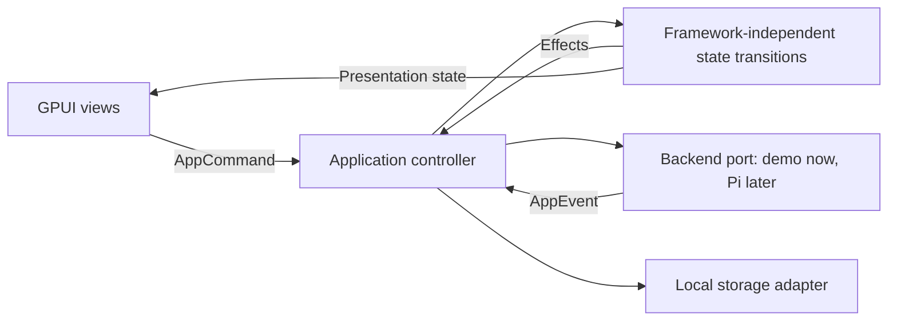

# Pipkin: single-pass GPUI prototype

Status: implementation plan; application not yet built.

This narrows [the desktop product plan](rust-desktop-client-plan.md) to one implementation pass and one reviewable deliverable: **a running, high fidelity Rust application on Omarchy/Hyprland/Wayland, with a reusable application foundation and a deterministic simulated Pi backend**.

The decision is whether to continue building Pipkin with GPUI. Approval should mean connecting real services to the existing application, continuing its components and tests, and refining known gaps. It should not require rebuilding a presentation-only mockup.

## 1. Define the pass

Build one coherent direction through one complete workflow:

**Choose a project and conversation → write a prompt → follow streamed work → inspect tool activity and changes → steer, queue, or stop → switch away and return → quit and recover the draft.**

Adopt the original plan's quiet, precise developer workspace. Use Zed as the engineering and interaction-quality reference. Make the conversation the primary surface; a full editor workspace would misrepresent this product.

The pass includes implementation, one batched native visual/interaction review, one correction batch, and a final verification. There are no competing design studies or separate disposable spikes. Build the risky capabilities inside the components that will ship. Finish with measured evidence and a go/conditional-go/no-go recommendation; stop at that review boundary.

**Confirmed platform scope:** Omarchy/Wayland first. Record the actual GPU, driver, compositor version, display scale, and Rust toolchain. Windows, macOS, other Linux desktops, and X11 remain unverified. A Linux success permits continued development; it does not establish cross-platform release readiness.

## 2. Use the source that is actually here

The workspace currently contains the original plan and the downloaded Zed source. The `../packages/…` Pi engine references in the original plan are absent. Treat those backend descriptions as integration context awaiting verification, not as an available service contract.

The inspected Zed revision is `a84689073d296dfd39987bc7dd478e43ef76d83a`. Its GPUI manifest identifies version `0.2.2`, and its toolchain file specifies Rust `1.98.1`. These are source observations, not proof that an independent application builds yet.

### Source reading map

Read the relevant reference immediately before implementing its counterpart; do not attempt to understand all of Zed.

| Prototype concern | Local reference | What to learn |
| --- | --- | --- |
| Application and platform initialization | [GPUI README](../zed/crates/gpui/README.md), [hello_world](../zed/crates/gpui/examples/hello_world.rs), [platform manifest](../zed/crates/gpui_platform/Cargo.toml) | Window creation, platform backend features, assets, application lifecycle |
| Entity ownership and background work | [ownership guide](../zed/crates/gpui/src/_ownership_and_data_flow.rs), [contexts](../zed/crates/gpui/docs/contexts.md) | Entity boundaries, weak handles, task and subscription lifetimes |
| Text editing and IME | [input example](../zed/crates/gpui/examples/input.rs), [editor input](../zed/crates/editor/src/input.rs) | UTF-16 platform ranges, marked text, selection, clipboard, input-handler integration |
| Transcript layout and scrolling | [list example](../zed/crates/gpui/examples/list_example.rs), [list implementation](../zed/crates/gpui/src/elements/list.rs), [conversation view](../zed/crates/agent_ui/src/conversation_view.rs) | Variable-height virtualization, bottom alignment, stable scroll state, incremental updates |
| Rich text and selection | [Markdown renderer](../zed/crates/markdown/src/markdown.rs), [selection](../zed/crates/markdown/src/selection.rs) | Text hit testing, selection representation, copying across rendered blocks |
| Tools, composer, and queued prompts | [thread view](../zed/crates/agent_ui/src/conversation_view/thread_view.rs), [message editor](../zed/crates/agent_ui/src/message_editor.rs), [message queue](../zed/crates/agent_ui/src/conversation_view/message_queue.rs) | Hierarchy, disclosure, submission states, queue behavior |
| Reusable controls and overlays | [UI components](../zed/crates/ui/src/components), [key dispatch](../zed/crates/gpui/docs/key_dispatch.md), [tab stops](../zed/crates/gpui/examples/tab_stop.rs) | Consistent control anatomy, focus scopes, action dispatch, dismissal |
| Change inspection | [file diff view](../zed/crates/git_ui_core/src/file_diff_view.rs), [agent diff](../zed/crates/agent_ui/src/agent_diff.rs) | Hunk structure, line numbers, additions/deletions, horizontal scrolling |
| Accessibility and UI tests | [accessibility guide](../zed/crates/gpui/src/_accessibility.rs), [a11y example](../zed/crates/gpui/examples/a11y.rs), [test example](../zed/crates/gpui/examples/testing.rs) | Stable node identity, roles, actions, focus, deterministic GPUI tests |

The small text-area example is not a production composer: its example editor returns no marked-text range and demonstrates only a subset of editing behavior. Likewise, a selectable Markdown block does not establish cross-message selection. Explicitly implement and test the missing behavior.

### Dependency strategy

- Create an independent Cargo workspace at this project root; exclude `zed/` from its members. Do not add Pi to Zed's workspace or alter the reference checkout.
- Pin `gpui` and `gpui_platform` to the same full Zed Git revision above. Use the local checkout for source study. Keep the application reproducible without an unrecorded local-path dependency.
- Verify the selected revision resolves and builds from the independent workspace immediately. Inspect transitive dependencies and any required root-level Cargo patches; dependency workspaces' patches are not automatically the application's patches. Record any necessary override and its reason.
- Enable the Wayland platform backend explicitly. The local README uses `gpui_platform::application()` for platform selection; do not combine APIs from unrelated GPUI revisions. Upstream also warns that GPUI is pre-1.0 and subject to breaking changes. [GPUI documentation](https://github.com/zed-industries/zed/tree/main/crates/gpui).
- Pin the working Rust toolchain and commit the application lockfile. If the inspected revision cannot be consumed, record the concrete problem and one deliberately chosen replacement revision; rerun the capability checks against that revision.
- Use GPUI framework crates directly. Zed's `ui`, `ui_input`, `markdown`, `editor`, and `agent_ui` manifests declare `GPL-3.0-or-later`; GPUI declares `Apache-2.0`. Keep those application crates as references in this pass instead of importing their dependency graphs. Record the provenance and declared licenses of any adapted source or bundled asset. This plan does not select a product distribution license.

## 3. Specify the finished experience

### Workspace composition

At a nominal 1440 × 960 logical pixels, use a roughly 240-pixel navigation pane, a flexible conversation, and a roughly 400-pixel optional inspector. These are initial layout values, not fixed constraints. Navigation and inspector have draggable dividers and remembered widths.

The navigation shows a project switcher, New conversation, search, and a compact conversation list with title, recency, and meaningful activity. The conversation header shows its title and project context. The main reading column uses consistent authorship and spacing rather than placing every message in a large decorative card. Tool activity appears as compact expandable rows. The composer stays anchored below the transcript. The inspector contains the changed-file list and selected diff.

The distinctive interaction is the connection between a reported change and its evidence: selecting a file reference or changed-file row reveals the corresponding diff without losing the transcript position or draft.

At narrow tiled widths, preserve conversation usability by hiding the inspector first and making navigation and inspection temporary, mutually exclusive panels. Opening and dismissing these panels restores focus predictably. Verify at 1440 × 960, 1024 × 768, and 720 × 800 logical pixels, then resize continuously between them.

### Visual system

Build both dark and light variants from shared semantic tokens. Give the dark variant the primary review treatment, with an equally usable light variant. Use neutral layered surfaces, subtle separators, one restrained accent, and explicit text/icons for status. Reserve elevated surfaces for menus and dialogs. Use a consistent icon family with verified asset provenance.

Start with a 4-pixel spacing rhythm, 30–32-pixel compact controls, approximately 14-pixel UI text, 15–16-pixel conversation text, and coordinated monospace code. Bundle licensed fonts or document stable fallbacks so text measurements are reproducible. Keep readable text width bounded when the inspector is closed. Test Unicode fallback rather than assuming the primary font covers it.

Specify hover, active, selected, disabled, keyboard-focus, loading, and error states in shared components. Offer text scaling and reduced motion. Keep motion limited to useful feedback; streaming must not continuously animate the whole window. Record final tokens and component conventions in `DESIGN.md` during implementation.

### Functional scope

| Surface | Must genuinely work in this pass |
| --- | --- |
| Project/conversation navigation | Switch seeded projects; create, rename, and search local fixture conversations; preserve selection, draft, and scroll per conversation; show empty and no-results states |
| Composer | Multiline wrapping, caret, mouse/keyboard selection, cut/copy/paste, undo/redo, IME composition, grow-to-limit then scroll, disabled/submitting states; Enter sends and Shift+Enter inserts a newline; never submit while IME composition is active |
| Composer accessories | Working model menu over fixture models; attach/remove local file references through a native picker; display metadata and validation errors; no upload implied |
| Transcript | Incremental Markdown paragraphs, lists, emphasis, links, fenced code with syntax highlighting; selectable text; code-copy controls; expandable tool inputs/results; timestamp and status details |
| Long history | Variable-height virtualized transcript; older fixture pages; stable viewport during appends, history prepends, tool expansion, and window resizing; Jump to latest |
| Execution controls | Submit, accepted/running, steer, queue follow-up, cancel, stopping, completed, failed, and uncertain-outcome states driven by simulated events |
| Changes | Read-only unified diffs with file list, line numbers, hunk headers, additions/deletions, horizontal scrolling, file selection, and empty state; label them “Workspace changes · Demo” |
| Commands and overlays | Searchable command palette, keyboard shortcuts, model menu, rename dialog, and compact preferences for theme/text size/reduced motion; consistent Escape and focus restoration |
| Persistence | Real per-conversation drafts, local demo conversations, selected conversation, theme, text size, and pane layout survive restart; visible save failures |

All exposed controls execute their advertised local behavior. Omit unrelated placeholder buttons. A small “Demo” indicator explains that agent output and changes are simulated; fixture selection and fault injection live in developer commands, not primary product navigation. Sending arbitrary text preserves that text but produces an explicitly scripted response, without claiming to understand or execute the request.

## 4. Keep a small architecture that can graduate

Start with three crates. Keep adapters as modules until there is a concrete reason to split them further.

```text
Cargo.toml                         independent workspace; excludes zed/
rust-toolchain.toml
crates/
  pipkin-core/                    ordinary Rust types, commands, events, state
  pipkin-ui/                      GPUI views, shared controls, theme, text layer
  pipkin-app/                     entry point, controller, adapters, storage
    src/adapters/demo.rs           deterministic implementation of backend port
    src/storage.rs                 local drafts/preferences/demo data
    src/platform.rs                dialogs, clipboard and platform boundaries
fixtures/                         versioned scenarios and generated-data seeds
assets/                           fonts and icons with provenance
docs/                             architecture, review script and scorecard
```

Data flow:



The core owns project, conversation, message, tool-call, and request identities; operation transitions; queue contents; command availability; and draft/save state. It contains no GPUI entities, colors, geometry, or transport frames. The UI owns focus, selection geometry, text layout, scroll handles, and open overlays. The controller connects the two and executes effects.

Use a narrow asynchronous backend port for listing/opening conversations, paging messages, submitting, steering, queueing, cancelling, inspecting operation status, and receiving snapshots/events. Model these as application capabilities, not as invented Pi wire protocol. Optional capabilities have explicit availability. A later Pi adapter translates the real engine contract into these types; version negotiation and protocol reconciliation belong there.

Commands/events carry stable conversation and operation identities; events also carry an attachment generation or equivalent stale-update guard. Keep connection state, execution state, and persistence state separate. Never route a late event into whichever conversation happens to be selected.

Keep render functions free of I/O. Retain and cancel tasks/subscriptions deliberately. Bound event queues, coalesce token deltas for painting, and move persistence, parsing, and expensive data work off the UI thread. Invalidate affected entities rather than rebuilding every transcript message for each token.

### Retained text components

Treat text as the main engineering risk, with two concrete components:

1. `ComposerEditor`: a reusable editing model and GPUI input-handler/rendering layer, with grapheme-aware editing, UTF-16 conversions, marked-text handling, selection, wrapping, undo history, and clipboard integration. Begin from the GPUI input patterns and implement the needed multiline behavior. Do not pull in the whole Zed editor to obtain one text field.
2. `TranscriptDocument`: parsed message blocks plus a document-level selection model addressed by stable message/block identity and text offsets. The mounted views provide hit testing and selection painting; selection content comes from the document model, including offscreen content. Copy and drag selection must cross message/code boundaries and virtualized rows. A collection of independently selectable labels is insufficient.

Cache completed Markdown blocks; limit reparsing and relayout to changed content. Define a scroll anchor as a stable item identity plus offset. Preserve it when heights change or old pages arrive. Follow the stream only when already following, with an explicit Jump to latest action to resume.

If these components need substantial framework patches or a full editor dependency to meet the gates, report that cost as a framework finding. Do not quietly remove selection or IME from acceptance to finish a prettier screen.

### Real local persistence

Use a small versioned SQLite store with a single background writer. Separate fixture conversation snapshots from desktop-owned preferences and drafts. Mark a draft Saved only after its write completes; debounce saves with a bounded interval and flush on conversation change and orderly exit. Test termination after acknowledged saves. Preserve unsaved text in memory on failure and offer copying it out.

The future real backend owns authoritative conversation history. The demo store must not become an alternate source of truth for real Pi sessions. Keep demo data in a distinct namespace so the production adapter can replace fixture history without migrating it into engine storage.

## 5. Make simulated execution useful evidence

Use a deterministic clock/seed and versioned event scripts. The demo adapter must respond to commands, including cancellation and queued work, rather than play an unrelated animation. Keep it available after integration as a development and regression backend.

Provide these scenarios through a developer command or launch argument:

| Scenario | Evidence it exposes |
| --- | --- |
| Normal coding task | Prompt acceptance, token streaming, tool progression, realistic Markdown/code, three changed files and final summary |
| Active work and follow-up | Steer the active run, queue two prompts, inspect/remove queued prompts, cancel, remain Stopping until confirmation |
| Tool/provider failure | Failed tool with expandable output; retained draft on rejected submission; explicit recovery action |
| Interrupted acknowledgment | Submission becomes Outcome unknown; simulated reconnect/status lookup resolves the same request; no automatic resend |
| Empty and stressed content | New conversation, no search results, long paths/titles, Unicode/emoji/RTL samples, missing attachment, malformed/incomplete Markdown |
| Large history and outputs | Deterministically generated 10,000 messages loaded in pages, mixed-height blocks, a large diff, bounded preview of oversized tool output |
| Persistence failure | Inject write failure and show unsaved status without losing the editable draft |

The normal scenario should tell one believable story: fix a failing project test, read relevant files, propose a small patch, show a test failure and correction, then summarize three fixture changes. Use realistic code, filenames, tool commands, and output. Keep all executable-looking commands inert.

The uncertain-outcome scenario validates client presentation and state transitions only. It does not prove real engine deduplication, reconnect semantics, or exactly-once execution.

## 6. Execute once, in dependency order

These are build steps within the same pass, not separately reviewed product phases.

1. **Establish the native foundation.** Resolve pinned dependencies/toolchain, document required system packages, open the actual Pi window on Wayland, initialize assets and tokens, and add the action/focus skeleton. Capture the machine baseline and exact launch command. Do not hide compilation or graphics blockers behind continued mockup work.
2. **Prove text inside the real application.** Build the composer and transcript with the real input-handler path, variable-height virtualization, cross-message selection, focus semantics, and representative accessibility nodes. Exercise IME, selection across recycled rows, and scroll anchoring early. These capabilities determine whether the rest of the polish is justified.
3. **Complete the workflow.** Connect core commands/events, demo adapter, navigation, streaming, tool disclosure, queue/steering/cancellation, model selection, attachments, diff inspection, overlays, and persistence. No view reads fixture files directly or owns fake timers for execution.
4. **Finish the chosen visual system.** Apply typography, spacing, control states, both themes, narrow layouts, icons, and clear error/empty states across the entire selected workflow. Capture the final conventions in `DESIGN.md`.
5. **Review and correct as one batch.** Run the scenario script, native input/accessibility checks, performance measurements, and screenshot matrix. Collect defects together; fix that batch; confirm the changed behavior once. Any unresolved essential failure remains visible in the scorecard.
6. **Deliver the running build and decision packet.** Include repeatable run instructions, fixtures, tests, native screenshots, measurements, limitations, and a short integration continuation map. Make one recommendation and stop for the owner's review.

If a hard capability remains broken after the correction batch, deliver the runnable result and its blocker. One pass is allowed to conclude that GPUI is unsuitable; the plan does not authorize an indefinite framework repair project.

## 7. Accept on evidence, not screenshots alone

Run checks against a release build on the recorded reference machine. Separate measured results, subjective observations, failures, and unverified items. The following thresholds are proposed acceptance targets, not existing benchmark claims.

| Gate | Required evidence |
| --- | --- |
| Native operation | Launch on actual Wayland; repeated resizing/tiling, minimize/restore, and suspend/resume do not break rendering or state |
| Text editing | Multiline editing and clipboard work; emoji/combining characters survive edits and undo; a real configured IME can compose/commit/cancel without premature send |
| Transcript selection | Mouse and keyboard selection/copy work across prose, code, multiple messages, and offscreen rows; streaming does not corrupt the selection |
| Scroll correctness | No jump when reading above the stream, prepending history, expanding tools, resizing, or returning to a conversation; Jump to latest restores following |
| Keyboard and accessibility | Complete the core workflow by keyboard with visible focus and overlay restoration; inspect semantic nodes and exercise a real Linux screen reader for navigation, composer, messages, and run status |
| Scale and themes | Both themes at normal and enlarged text; native 100%, 125%, and 150% display scale where available; no clipping or unusable controls at the three target window sizes |
| Large histories | Responsive paged navigation and selection through 10,000 mixed-content messages; bounded mounted views and caches; measure memory during repeated traversal and streaming |
| Responsiveness | Target p95 input-to-paint below 50 ms and p95 scrolling frame time at or below 16.7 ms on a 60 Hz reference run; record instrumentation and sampling duration |
| Startup/memory | Target warm usable launch ≤1 second, cold launch ≤2.5 seconds, and idle process RSS <250 MB on the standard fixture; record definitions, repetitions, and actual values |
| Persistence | After switching conversations, reopening, and killing the process following Saved status, acknowledged drafts remain intact; injected failures visibly remain unsaved |
| Application correctness | Cancellation waits for settlement; stale events cannot affect another conversation; unknown submissions cannot be blindly repeated; UI and palette share availability rules |
| Visual quality | Owner can read, write, follow work, and inspect changes comfortably; spacing, typography, disclosure and control states remain consistent with realistic content |

Instrument event-to-paint and frames where possible; distinguish submission of a rendered frame from actual display presentation. Do not label a timer around a state update “input-to-paint.” If measurement tooling, an IME, a screen reader, or a scale configuration is unavailable, record the gate as unverified rather than passed.

Automate core transition tests, stale-event handling, draft round trips/failures, Unicode/selection ranges, and GPUI focus/action/scroll behavior. Use deterministic timers. Run formatting, clippy, and workspace tests through this workspace's documented commands. Keep native IME, screen-reader, GPU, compositor, and visual inspection as explicit manual checks; headless tests cannot establish those results.

Use native application captures for the screenshot matrix: normal streaming, expanded tools and diff, failure/recovery, empty state, and narrow layout, across both themes. A browser recreation is not evidence for GPUI. Include a short screen recording if capture is available.

### Decision rules

- **Go for continued development:** the owner approves the experience; essential text, scrolling, keyboard, native-rendering, accessibility, and persistence gates pass on the target machine; remaining work is bounded and documented.
- **Conditional go:** the experience is approved, but named measurements or native checks remain unverified, or a limited gap has a credible repair path. State the exact condition and cost before calling the framework decision settled.
- **No-go:** essential interaction remains broken, performance requires disabling required behavior, or viability depends on disproportionate editor coupling or framework maintenance. Retain the independent core, fixtures, persistence, contracts, and findings for the next framework decision.

No result from this pass claims production reliability or cross-platform approval.

## 8. Deliverables and continuation

The implementation pass is complete when it provides:

1. A launchable native executable and source, with the exact toolchain, dependency revision, lockfile, assets, and setup/run commands. Suggested stable interface: `rtk cargo run -p pipkin-app --release -- --demo normal`.
2. The finished workflow, reusable controls/text components, small independent core, working local storage, and replaceable demo adapter.
3. Fixture scenarios and tests that remain usable when a real backend is added.
4. `DESIGN.md`, a concise architecture/dependency decision record, and a 10-minute owner review script.
5. A scorecard with actual measurements, native captures, tested environment, failures/unverified items, and one recommendation.
6. A continuation map naming the adapter methods and backend facts still needed, without pretending the existing demo contract is Pi's wire protocol.

The owner review should send a prompt, scroll away during streaming, select/copy across messages, expand a tool, open a diff, queue a follow-up, cancel a run, switch conversations with unsent text, and relaunch to recover the draft. Repeat the central reading/writing steps in a narrow tiled window and the alternate theme.

If approved, the next work begins by obtaining and verifying the actual Pi service sources, mapping capabilities and snapshots/events into the existing core, and adding the real transport adapter beside the demo adapter. Then connect authoritative history, real model discovery, engine execution, file changes, and lifecycle/recovery incrementally. Preserve the UI, command registry, component system, local draft storage, and deterministic scenario tests.

Deferred from this pass: real model calls, engine process management, RPC/Chord/CBOR implementation, authentication, real tool execution, applying/reverting patches, embedded terminal/editor, extension UI compatibility, installers, updates, cloud/team features, broad platform certification, and the original plan's multiple visual studies. These remain product work after the prototype decision.
