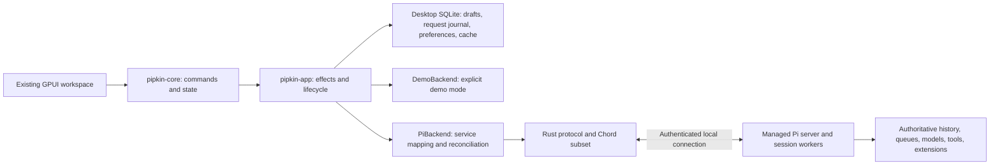

# Rust Desktop Client for Pi: prototype to working product

Updated: 2026-10-04. Status: implementation roadmap. M0 is done, M1 is met with caveats, and M2 and M3 are complete (exit criteria met by real-engine tests; the window was checked on screen apart from the file picker); see "Implementation status" near the end of section 10 for exactly where to resume.

## 1. Continue the application that exists

Build the real Pi client inside the existing **Pipkin Rust/GPUI application**. Retain its composer, virtualized transcript, selection model, themes, workspace, command registry, pure state core, draft writer, and deterministic demo scenarios. The next work is engine integration and production correctness, followed by product completion and platform qualification.

The [prototype plan](gpui-prototype-plan.md) records the original build scope. Its opening “application not yet built” status is historical: the code, [architecture](architecture.md), [continuation map](continuation-map.md), and [scorecard](scorecard.md) establish the implemented baseline. This document supersedes the original product plan's framework competition, three visual studies, and disposable RPC prototype milestones. Continue the direction in [DESIGN.md](DESIGN.md).

GPUI has a **conditional go on the tested Omarchy/Hyprland/Wayland machine**, not general platform approval. Preserve the exact GPUI revision in [Cargo.toml](../Cargo.toml), `a84689073d296dfd39987bc7dd478e43ef76d83a`, and the recorded Rust toolchain until a deliberate dependency change is justified. Close the outstanding text, accessibility, scaling, and lifecycle checks during integration. Reopen the framework decision only if an essential requirement cannot be met at a bounded maintenance cost.

The product remains a local developer workspace:

**Open a real project → create or resume a conversation → send a prompt → observe actual model/tool work → inspect workspace changes → steer, queue, or stop → reopen without losing context or duplicating work.**

First ship an Omarchy/Wayland daily-use alpha. Broader Linux, macOS, and Windows support remain explicit later qualification tracks. Defer cloud/team features, a marketplace, a full editor, an embedded terminal, and automatic patch reversion. Provide external editor and terminal launching in the local workflow.

## 2. Source-grounded starting point

This revision reviewed Pipkin at `807391929ba7a409b1406d60da60ec64a4065103` and the adjacent Pi checkout at `200387122ca450d6387f033949423114a270b96c`. These identify inspected baselines, not a shipped compatibility promise. Record the tested engine revision and service-contract version in a build manifest before integration.

Pi is a separate repository; the working copy is the fork at `../../pi-fork/pi` relative to this document (`git@github.com:jasona/pi.git`). The links below point into that checkout; they are not Pipkin package directories or runtime dependencies. A clean build must obtain a pinned engine artifact/source independently of that directory layout. The continuation map's statement that engine sources are absent from this workspace is still true for Pipkin itself; adjacent sources were available for this review.

### What the prototype actually implements

| Existing code | Preserve | Production gap |
| --- | --- | --- |
| [Core state](../crates/pipkin-core/src/state.rs), [commands/events](../crates/pipkin-core/src/protocol.rs) | Commands → effects, shared availability, generation guards, stopping/unknown/save states | No connection lifecycle or capability state; operations and items use process-local counters; create/rename and queue management are local |
| [Backend port](../crates/pipkin-core/src/backend.rs) | Application-level boundary independent of GPUI and transport | Synchronous `bootstrap()` and fire-and-forget `request()` need asynchronous initialization, errors, shutdown, and richer snapshots |
| [Controller](../crates/pipkin-app/src/controller.rs) | Bounded event channel and token coalescing | Always constructs `DemoBackend`, restores demo conversations, installs demo globals; no engine host or real startup path |
| [Storage](../crates/pipkin-app/src/storage.rs) | Versioned SQLite, single bounded writer, commit acknowledgments | Drafts persist text only, keyed by numeric conversation ID; no durable request journal, attachments, or real-session namespace; fallback/load failures are logged rather than fully represented in UI |
| [Composer](../crates/pipkin-ui/src/text/), [transcript](../crates/pipkin-ui/src/transcript/) | Editing, Markdown/code, document-level selection, virtualization, anchoring | Real IME and screen-reader gaps; real backend content, bounded caches, and large-output retrieval still need integration |
| [Workspace](../crates/pipkin-ui/src/shell/) | Navigation, overlays, themes, model menu, tool and diff views | Models/projects/diffs are fixtures; search matches loaded conversation titles; attachments are file references, not delivered model content |
| [Demo adapter](../crates/pipkin-app/src/adapters/demo.rs), [scenarios](../fixtures/scenarios/) | Deterministic regression backend and fault scenarios | Demonstrates client behavior only; cannot establish real deduplication, tool execution, or reconnect correctness |

The scorecard reports 135 passing prototype tests and partial native verification. It records roughly 140 MB idle RSS, 175–218 ms warm window mapping, and p95 input-handler-to-paint of 4.8 ms. These are historical prototype measurements: window mapping is not usable startup, paint submission is not display presentation, and engine memory is not included. Re-measure the integrated application.

### What Pi already supplies, and what it does not

Inspect these contracts before changing either repository:

| Pi source | Available baseline | Required continuation |
| --- | --- | --- |
| [Protocol](../../pi-fork/pi/packages/protocol/README.md), [client](../../pi-fork/pi/packages/client/README.md) | Protocol v8 framed CBOR, server/session routes, attachment fencing; Chord service snapshots and updates | Experimental, no compatibility guarantee; peer authentication is not implemented; Rust must implement the required Chord semantics as well as envelopes |
| [Session contracts](../../pi-fork/pi/packages/coding-agent/src/experimental/services/sessions.ts) | List, create, remove, attach, detach | Summaries expose server/session IDs and creation time, not title/cwd/activity; creation options lack project cwd; add project metadata and rename |
| [Agent controller](../../pi-fork/pi/packages/coding-agent/src/experimental/services/agent-controller.ts) and [provider](../../pi-fork/pi/packages/coding-agent/src/experimental/services/agent-controller-provider.ts) | Prompt, steer, follow-up, cancel queued entry, abort, compact, wait for known prompt ID | No client idempotency key or lookup by client request ID; distinguish operation acceptance from settlement; define stop/queue semantics |
| [Models](../../pi-fork/pi/packages/coding-agent/src/experimental/services/models.ts) | Provider/model identity, catalog, selection, thinking levels, refresh | Native credential onboarding and auth status contract; model selection is session service state, not a field on `prompt()` |
| [Transcript](../../pi-fork/pi/packages/coding-agent/src/experimental/services/transcript.ts), [service overview](../../pi-fork/pi/packages/coding-agent/src/experimental/services/README.md) | Durable conversation view, including active entries and live/inbox/agent/usage documents | Complete history before reset/compaction needs paging over durable entries; root conversation only, no tree/subagent navigation contract |
| [Durable runtime](../../pi-fork/pi/packages/durable/README.md) | Worker-owned execution and persistence | Verify process/power-loss guarantees; package experimental server/worker paths, which are currently excluded from published packages and standalone binaries |

Do not assume the demo's `Token`, `ToolStarted`, or `StatusResolved` variants exist on the wire. Pi publishes replicated service state. The adapter must translate that state and its revisions into stable presentation updates.

## 3. Architecture and ownership

Keep the three existing crates. Add transport and host modules under `pipkin-app` first; extract a reusable `pi-client` crate once the conformance harness establishes a useful boundary. Do not split storage, platform, and testing into new crates merely to match the old suggested layout.



Proposed modules, not existing implementations:

- `adapters/pi/`: map Pi contracts into core snapshots/events and commands.
- `pi_client/`: framing, handshake, routing, service calls, subscriptions, replica decoding.
- `engine_host/`: resolve/launch the pinned engine, readiness, discovery, shutdown, bounded recovery.
- `workspace_changes/`: read-only project Git status/diff service unless Pi gains that capability.
- Integration fixtures/harness: real engine with fake providers, transport faults, process termination.

Ownership rules:

1. Pi owns session identity, authoritative history, model configuration, submitted input, queued input, and execution state. The desktop never writes worker-owned databases.
2. Pipkin owns project bookmarks, drafts, unsent attachment metadata, preferences, request intents, UI selection/scroll state, and rebuildable offline/search caches. A cached transcript is explicitly stale when disconnected.
3. The core remains free of GPUI and wire types. Views dispatch commands; controller tasks execute effects. Rendering does no process, storage, transport, or parsing work.
4. Local IDs may remain internal handles, but must map to stable, namespaced engine identities. Preserve `(conversation, generation, op)` guards and add server/session/attachment routing and replica revision checks.
5. Background queues, frame sizes, pending requests, output previews, parsing work, and caches have explicit bounds. Overflow must cause backpressure or a visible resync/error; never silently lose authoritative state updates.

Use one production backend: the durable Pi service architecture. Keep the demo adapter as a test/development backend. Do not add a second production implementation based on legacy JSONL RPC to bypass missing service work.

## 4. Make the backend port suitable for real services

Evolve the application contract before connecting live tools. Keep demo behavior working through the same port.

| Application capability | Required change |
| --- | --- |
| Startup | Replace blocking complete bootstrap with asynchronous connection/catalog/session initialization. Show connecting, ready, reconnecting, offline, incompatible, and failed states independently of run/save states |
| Projects and conversations | Add open/register project and backend create/rename operations with pending/success/failure results. Map one desktop conversation to one Pi Session/root conversation initially; defer branching/subagent navigation |
| Opening and switching | Hydrate history **and** run/queue/model state. Detach or retire subscriptions deliberately. Pi currently has one selected Session attachment per client connection: start with one active attachment and rehydrate on switch; do not imply continuous live updates for detached sessions |
| History | Use opaque backend cursors and stable item IDs, not `before: Option<ItemId>` arithmetic. Add page request identity, loading/error/retry, deduplication, and cancellation on switch |
| Submit and steer | Persist request identity and immutable payload before transport. Correlate acknowledgments to the exact submission/steering item, not the latest user row |
| Follow-ups | Add backend enqueue/remove requests and authoritative queue snapshots. Preserve text, attachments, and agreed model semantics; handle `already_consumed` races |
| Status | Replace `StatusResolved { accepted: bool }` with pending/running/completed/failed/cancelled/definitely-not-accepted/unknown outcomes and durable operation identity |
| Replicated output | Upsert by stable message/tool IDs and revisions. Reconcile optimistic rows with authoritative entries; snapshot replacement and replay must not append duplicate tokens or tools |
| Models/capabilities | Derive action availability from engine capabilities, connection state, model/auth readiness, and core run state. A menu change updates `Models.select()` and waits for authoritative state |
| Changes and large results | Real asynchronous diff refresh and bounded full-output retrieval/export; loading, stale, unavailable, and error states |

Expand the core for unknown content kinds, thinking/usage/error information, compaction boundaries, and pending input as supported by the inspected `ConversationView`. Preserve unsupported content visibly instead of misrepresenting it as plain assistant text. Keep transport-specific decoding in the adapter.

### Resolve queue and cancellation semantics explicitly

The prototype's `after_settled()` starts the next in-memory prompt and its Stop action retains queued work. Pi's `followUp()` already queues durable input; its documented `abort()` withdraws queued input as well as aborting active work.

For real mode, make Pi the sole queue executor and remove client-side automatic dequeue/submission from that path. Preserve the intended Stop behavior by adding an engine operation that stops active work while retaining and pausing the queue, plus explicit queue resumption. If the engine contract instead keeps “stop and clear queue,” label it exactly and deliberately revise the product behavior before exposing it. Never wire `abort()` to a button promising queue preservation. Test completion/stop/enqueue/remove races and reconnect with pending entries.

Steering and queue additions need independent request IDs even when attached to one run. A stale acceptance must not mark another prompt delivered. Do not silently discard attachments from queued or steering input as the current text-only queue path does.

## 5. Establish the engine contract and Rust client

Pin the engine and document a bounded desktop service contract. Application capabilities need their own versions; matching the envelope version alone is insufficient.

Implement in dependency order:

1. Engine build/run artifact with server, coordinator, workers, runtime dependencies, and required assets included. Publish a machine-readable version/capability manifest and readiness result. Source-only `PI_EXPERIMENTAL=1` scripts are a development entry point, not the shipping launcher.
2. Authenticated local transport, restrictive endpoint permissions, expected `serverId` validation, and explicit profile discovery. A random attachment ID or matching server ID is not authentication. Start with Unix sockets; implement equivalent access control before other platforms ship.
3. Length-prefixed CBOR framing and strict-JSON validation using Pi's fixtures, including fragmentation, coalescing, bounds, unknown fields, numeric limits, and malformed input. Negotiate compatible limits; return actionable mismatch errors.
4. The required Chord service catalogue/control calls, method invocation, errors, subscription lifecycle, initial snapshots, sequencing, and Delta path dictionaries/codecs. Hydrate before releasing buffered updates. Missing revisions invalidate the replica and trigger reattachment/resnapshot.
5. Typed bindings for SessionDirectory, SessionManagement, Models, AgentController, Transcript, and the new desktop-required history/metadata/status/auth capabilities. Missing optional capabilities disable the affected action with a reason.
6. Reconnect using a fresh authenticated connection and attachment generation; restore subscriptions and reconcile requests. Dispose retired subscriptions and bound retries. No automatic mutation replay.

The Rust conformance suite must exchange generated valid/invalid fixtures with Pi's TypeScript implementation and then attach to a real test server. A successful hello frame is not a completed integration milestone.

Backend deliverables owned in the Pi repository:

- Project cwd on session creation, canonical session metadata, title/rename, updated activity, and documented missing/moved project behavior. Existing session metadata on disk does not make it available through the service DTOs.
- Durable client request deduplication and lookup for prompt/steer/follow-up and other retryable mutations; operation and queue status sufficient for reconnect.
- Authoritative history paging, stable identity/cursor semantics through compaction and live appends, and access to complete stored tool results where available.
- Stop/pause/resume queue semantics from Section 4, plus an authoritative settlement signal.
- Provider authentication/status and the initial native extension interaction contract.

Implement these as real service changes, with TypeScript contract tests and matching Rust fixtures. Do not fabricate status by searching prompt text or inspecting private SQLite tables from Pipkin.

## 6. Make submission and recovery crash-safe

The critical trace is: **submit → engine accepts → connection or UI dies before acknowledgment**. The prototype's unknown state is useful presentation, but its operation IDs restart at 1 and its pending submission is not durable.

Required submission sequence:

1. Assign a globally unique client request ID scoped to an engine profile and session. Capture text, attachment content/reference semantics, model configuration, and mutation kind.
2. Transactionally persist that intent before clearing the recoverable draft or sending anything. If persistence fails, keep the draft and disable dispatch with a visible reason.
3. Engine acceptance atomically records the deduplication key with the durable submission. Reusing the same key/payload returns the same operation; reusing it with different content fails. Define retention and expired-key behavior.
4. Record the engine operation/entry ID and reconcile the optimistic row. Keep “accepted” distinct from “completed.”
5. On timeout/disconnect/restart, look up the same request. Unknown stays unknown; “not found” only means safe to resubmit when the server can prove non-acceptance within the deduplication contract. A lost receipt or expired record is not that proof.
6. Mark settlement durably and retain enough reconciliation state to prevent duplicate acceptance across desktop or engine restarts.

Request deduplication does not guarantee exactly-once shell/network/file effects. A tool can partially execute before failure. Explain partial completion and require inspection before an explicit new run. Separate a rejected submission retry from restarting a failed run that may already have changed files.

| Failure | Required result |
| --- | --- |
| UI crash before send | Journal/draft recovers; no unrecorded dispatch |
| UI crash or connection loss after acceptance | Reattach and recover the same operation without duplicate prompt/tool execution |
| Engine crash | Bounded restart, inspect durable runtime state, show recovered/interrupted status; no blind prompt replay |
| Stale or missing replica update | Reject stale route/generation, resnapshot after gaps, preserve reading position where IDs survive |
| Cancellation delay or disconnect | Remain stopping/unknown until authoritative settlement; transport request cancellation is not agent cancellation |
| Provider retry/auth failure | Show engine retry/error state; client does not invent its own duplicate run retry |
| Storage full/corrupt/incompatible | Explicit unsaved/recovery mode, preserve memory text, offer export; do not claim a temporary fallback database is durable user storage |
| Repeated host crash | Stop restart loop, surface diagnostics and recovery actions |

## 7. Complete durable desktop state and engine lifecycle

Upgrade storage with tested migrations and backups. Keep demo history out of engine storage and namespace **all** session-scoped desktop data by backend/profile/server/session. The existing `demo_conversations` table alone does not isolate numeric draft IDs and selection preferences.

Persist draft text and attachments together; track add/remove changes in revisions and restore missing-file validation on reopen. Include selected model intent only where it cannot conflict with authoritative session settings. Persist request intents and recoverable UI state. Queue contents come from Pi; offline unsubmitted drafts must never masquerade as accepted queue entries.

Keep the single writer and commit-acknowledged save state. Surface preference and metadata write failures, startup read failures, and fallback mode. Support retry/export from failed-save state; flush latest dirty revisions on switching and orderly exit without blocking rendering. Preserve unsent input on rejected commands even if a newer draft already exists. Refuse incompatible newer schemas; coordinate application rollback with database compatibility. Test process-crash durability separately from host/power failure.

Engine lifecycle policy for the first release:

- Use one managed local engine profile with worker ownership retained by Pi. Closing the desktop detaches the UI and flushes desktop state; active engine work can survive and be reattached on relaunch.
- Provide a distinct quit/stop-engine action with active-work disclosure. Shut down only processes owned by this profile; never kill an unrelated installed Pi instance.
- Coordinate launch/attach across multiple windows or app launches with a lock and verified endpoint. Do not spawn duplicate engines or sessions after readiness timeouts.
- Launch with explicit executable, argument array, cwd, and environment. Do not depend on interactive shell startup files. Detect missing tools and invalid cwd before dispatch.
- Keep stdout/stderr bounded and redacted, readiness timed, shutdown orderly, crash restart capped. Exercise desktop-icon launch, sleep/resume, stale sockets, and orphaned worker recovery.
- Bundle the tested engine for release. External development engine overrides are explicit and version checked; general independently installed engine support can follow later.

Read-only offline history comes from a rebuildable cache marked with last synchronization time. Draft editing remains available offline; executing/queueing requires a ready, reconciled connection.

## 8. Connect every existing surface to actual work

### Projects, conversations, history, and search

Use a native folder picker and real cwd validation. Support non-Git projects and moved/deleted directories. Add engine-backed create/rename and recover their outcomes; do not retain `SaveConversation` as the authoritative real-session mutation.

Open existing Pi sessions and hydrate active operations as well as transcript content. Preserve draft, scroll anchor, selection, and tool expansion when switching. Initial alpha may attach one session at a time; engine work continues while detached. Add separate connections/subscriptions later only when background live observation is implemented and bounded.

History paging must reach entries before compaction, avoid duplicates at the live/history boundary, and preserve stable IDs. Keep mounted views and cached pages bounded through repeated traversal. Search project/conversation metadata first, then indexed historical messages; clearly disclose partial/offline coverage. Opening a result loads its context and offers a predictable return path.

### Models, credentials, and attachments

Populate the model menu from Pi's catalog using `(provider, modelId)`, including model/thinking configuration and credential readiness. Serialize selection with prompt dispatch or extend the engine request contract so a send uses the intended configuration. Never display a local model preference as confirmed engine state.

Reuse Pi's established credential mechanism initially; add native setup/status flows without copying secrets into drafts/preferences or logs. Missing credentials, expired login, no models, and provider failures need actionable states. Routine tests use fake providers, not credentials or paid requests.

The inspected prompt contract accepts message text and optional encoded images; it does **not** accept arbitrary filesystem attachments. Define each attachment type: project file reference rendered into the prompt, bounded text content inclusion, or validated image content. Preview what is sent, enforce type/size limits, revalidate files at send time, preserve payload semantics for reconciliation, and report inaccessible/changed files. Add transport/blob support if larger payloads require it; do not silently truncate or pretend a selected file was delivered.

### Tools and workspace changes

Render actual tool identity, arguments, progress, output, errors, and settlement from engine state. Keep the existing bounded preview but provide retrieval/export of complete results when supported. Treat streamed output and Markdown as untrusted content; no automatic remote image fetches or command execution from rendered text.

Replace fixture diffs with an asynchronous read-only workspace service. Inspect staged, unstaged, untracked, renamed/deleted, and binary files; bound large patches and handle non-Git/missing repositories. Refresh on tool settlement and debounced filesystem changes, with explicit refresh/error/stale states. Use argument arrays and validated paths for Git/editor/terminal calls.

Keep the label **Workspace changes**: these can include user edits and unrelated work. Do not claim run attribution or offer “Undo run” without snapshots and conflict handling. Patch application/reversion is deferred; actual Pi tools may still edit project files as part of requested work.

### Extensions, commands, and interaction quality

Keep extension execution in Pi. Define native selection, confirmation, input/editor prompts, notifications, and status interactions with stable request IDs, cancellation, timeouts, and disconnect behavior. Pi's current presentation-local slash commands and TUI facets are not automatically remote desktop capabilities. Publish a compatibility matrix; unsupported terminal-only interactions fail visibly instead of hanging a run. Do not load arbitrary extension code into GPUI.

Continue one command/availability registry for buttons, menus, shortcuts, and palette. Add real project/auth/reconnect actions, configurable keybindings and send behavior, external editor/terminal launching, and release-appropriate settings. Keep demo labeling and developer scenario actions only in explicit demo mode; real mode must never fall back to simulated success.

## 9. Close prototype gates while integration proceeds

Use [scorecard.md](scorecard.md) as the baseline of measured, observed, failed, and unverified results. Do not turn an unverified entry into a pass because integration builds.

- Correct composer caret/IME candidate geometry, including `invalidate_character_coordinates()` where required; test actual compose/commit/cancel and no premature Enter-send with a configured IME.
- Expose composer text, caret, and selection to accessibility; complete an actual screen-reader workflow through navigation, composer, transcript, tools, and run status. An inspected AT-SPI tree is insufficient.
- Verify both themes, enlarged text, visible focus, reduced motion, narrow layouts, 125%/150% scaling, minimize/restore, and suspend/resume on the actual compositor.
- Measure display presentation separately from frame submission, usable startup separately from window mapping, true cold startup separately from partially evicted caches, and desktop memory separately from engine/worker memory.
- Re-test offscreen selection, history prepend, tool expansion, resize anchoring, and repeated traversal under real service updates. Coalesce expensive Markdown/highlight work, cancel obsolete parses, and bound caches without breaking selection.
- Review the pinned dependency patches noted in [decisions.md](decisions.md) and the GPUI skill. Document which are necessary for the selected revision and validate any adopted patch; avoid unmeasured dependency churn.

The initial targets remain warm usable UI ≤1 s, cold ≤2.5 s, p95 input-to-presentation <50 ms, p95 scrolling within 16.7 ms at 60 Hz, and desktop idle RSS <250 MB on the recorded reference fixture. Provider readiness must not block initial usable UI. Record sample sizes, workloads, engine resource budgets, and any revised targets before judging the result.

## 10. Delivery sequence and acceptance criteria

Each milestone produces a runnable build, targeted tests, and an updated integration scorecard. Dependencies determine order; dates should be estimated after M1 exposes the protocol and backend work. The old six-to-nine-month estimate assumed a different staffing/platform scope and is not a new commitment.

| Milestone | Work and primary ownership | Exit criterion |
| --- | --- | --- |
| **M0 — Preserve and prepare** | Pipkin: explicit real/demo composition, namespaced storage migration, asynchronous backend lifecycle, source/version manifest, retained demo regression suite | Existing demo remains deterministic; real mode starts with honest connecting/unavailable states and cannot show fixtures as real data |
| **M1 — Real read path** | Pi: runnable pinned host, auth and metadata contract. Rust: protocol/Chord conformance, attach, Models/Transcript hydration | From a clean developer setup, authenticate to a real Pi test server, list/open a session, render its actual state, switch and reject delayed old-attachment updates; no live provider required |
| **M2 — First complete real workflow** | Pi + Pipkin: project/session creation, model selection, prompt/tool streaming, journal/dedup/status, engine lifecycle, actual read-only diffs | In a temporary project, a real Pi engine with a deterministic test provider executes a file-changing tool; Pipkin displays the output/diff and reopens the same history. Drop acknowledgment and kill/relaunch UI without accepting the prompt twice |
| **M3 — Daily-use execution and recovery** | Pi + Pipkin: authoritative steering/queue/stop, reconnect/status settlement, credentials, attachments, persistence failures | Steer, queue/remove, stop, resume, switch, and restart work correctly; attachments survive and reach the intended input path; engine/UI/disconnect/storage fault matrix passes |
| **M4 — Complete local product** | Pipkin + required Pi services: pre-compaction history, search, complete tool results, supported extension dialogs, editor/terminal actions, offline cache; close native gates | The core workflow is usable without demo data; 10,000-message traversal remains bounded; real IME/screen reader/scaling/lifecycle checks pass; unsupported features are explicit |
| **M5 — Distributable Wayland alpha** | Packaging/platform: bundled engine/runtime, desktop integration, clean install, upgrades/rollback, diagnostics, soak tests | A clean supported Omarchy/Arch installation runs the workflow from a desktop launcher without adjacent source checkouts; upgrade and recovery preserve acknowledged drafts/history |
| **M6 — Broader release** | Platform qualification and beta | Each advertised OS passes installation, text/accessibility, graphics, process/storage recovery, and update tests; measured beta reliability and usability targets are met |

M2 is the first genuinely functioning client, not the end of the product work. M3–M5 are required before calling it a reliable daily-use local application. Native accessibility/platform work begins at M0 and remains a release gate, rather than being postponed to M6.

### First implementation batch

1. Capture current demo checks and record the two repository revisions; update the continuation map to the verified contract inventory when implementation begins.
2. Add explicit backend selection and lifecycle/capability state, keep the current demo path, and remove hard-coded demo dependencies from real-mode composition.
3. Design and migrate stable session namespaces, full drafts, and request intents before any live mutation path is enabled.
4. Build the engine test launcher and Rust framing/Chord fixture harness; implement authenticated attach and a real read-only transcript/model path.
5. Land Pi project metadata and idempotent submission/status contracts with tests, then connect submit and recovery.
6. Demonstrate one real tool edit, actual diff, reconnect, and relaunch in a disposable project, using a fake provider. Keep live-provider verification separate and explicitly controlled.

### Implementation status (updated 2026-10-04; read this first when resuming)

**Where we are: M0 is done, M1 is met with caveats, M2 and M3 are complete, and M4 and M5 are complete as build milestones; the native and install gates are with the owner (native-gate-testing.md).** M2 is committed and pushed (`97dc6f7`). M3 is in the working tree, uncommitted. M3 needed no new Pi changes; the Pi changes are the M2 ones, now committed and pushed in the fork (`../pi-fork/pi`, branch `client-session-cwd-and-request-ids`, `646a5841a`). The older `../pi` checkout is no longer used.

| Milestone | State | Evidence |
| --- | --- | --- |
| M0 preserve and prepare | **Done** (open: source/version manifest) | Explicit `Mode`, `Connection` state, async `Backend::start(sink)`, namespaced storage v3, crash-safe submit journal v4 |
| M1 real read path | **Met, with caveats** | Real handshake, trust checks, catalogue, Delta hydration, session listing, attach, `Transcript` subscription and switching all pass against a real Pi server (3 opt-in tests, run repeatedly). The app was launched against it and showed the real session list and an opened session |
| M2 first real workflow | **Complete** (caveats below) | 7 real-engine e2e tests: a real Pi engine plus a deterministic stub provider runs a file-changing tool; Pipkin shows output and diff and reopens the same history; dropped ack and lost prompt then relaunch do not accept the prompt twice; engine crash restart and lifecycle |
| M3 daily-use execution and recovery | **Complete** (caveats below) | 16 more real-engine e2e tests (23 in all, run repeatedly, in parallel): stop, steer, follow-up, remove-queued, resume after restart, run started elsewhere, switching conversations, attachments (text, image) and their survival across a restart, lost acknowledgments (reply dropped, request dropped, app killed before it could ask), connection cut mid-run, engine killed mid-run, storage refusing the journal, provider configured after start |
| M4 complete local product | **Complete (features); native gates handed to the owner**, tracked in [native-gate-testing.md](native-gate-testing.md) and not passed | 7 new real-engine e2e tests on top of M3's 23 (history past a compaction, complete tool output, offline copies and search, editor/terminal launch, a real extension asking three questions, decline and reconnect), a repeated 10,000-item traversal test, mock-engine paging of 10,000 entries, storage, core and adapter tests |
| M5 distributable Wayland alpha | **Complete (build, package, verify in a scratch prefix); install on a clean system handed to the owner**, tracked in [native-gate-testing.md](native-gate-testing.md) gates 8 to 11 and not passed | An Arch package (`packaging/PKGBUILD`, built with `makepkg`), a bundled engine found without any checkout, `--version`/`--diagnose [--probe]`, a clean-environment install check, all 31 real-engine tests against the unpacked engine, an upgrade test from every earlier schema, and a 1500-prompt soak; see [packaging.md](packaging.md) |
| M6 and later | Not started | |

`cargo test --workspace`: 468 pass, 35 ignored (real-server and real-engine tests, which need `PIPKIN_PI_REPO`). Clippy and fmt clean.

#### M4 summary and caveats

M4 has two halves: product features, which are built and tested, and native gates, which are only partly run (see the table). **The features are done.** At the owner's direction ("just move on and give me separate notes for testing"), M4 is marked complete as a feature milestone and the native gates are moved to [native-gate-testing.md](native-gate-testing.md) for the owner to run. The original exit criterion's "real IME/screen reader/scaling/lifecycle checks pass" is **not met**: IME and 150% are partial, Orca does not yet speak typed characters or caret moves, and minimize/restore, suspend/resume, cold boot and presentation latency are unverified.

Built, with Pi changes in the fork (`../pi-fork/pi`, branch `client-history-and-ui-requests`):

- **History before a compaction.** New Pi service `History` (`pi.history`, pages `Conversation.entries()` newest first, 50 per page in Pipkin). Opening a conversation asks cheaply whether anything lies before the live view; a compaction or reset while it is open moves that and is noticed. "Load earlier messages" pages back with stable item ids, no overlap at the boundary, and a tool call and its result that fall on either side of a page join into one item. A failed page says so and waits for the person to ask again (it does not retry in a loop). An engine without the service simply has no older history to offer.
- **Search.** Titles filter as before. Messages are found by full-text search (SQLite FTS5) over the saved copies, with the match marked, ranked, limited to 40, and a line saying exactly how much was searched ("Searched the saved copies of N conversations (M messages) on this computer. Earlier history that has not been loaded here is not included."). Opening a hit selects its conversation, pages back until the message is loaded (at most 60 pages, then says it is gone), scrolls to it, and offers "Go back". Hits can be opened from the palette.
- **Complete tool results.** Each finished tool block has "Copy output" and "Save output…" (the full text, fetched from the engine when the preview is cut: from the live view, then up to 20 pages of history), and the palette has the same for the latest tool call.
- **Extension questions.** New Pi services `UiRequests` (remote) and `UiRequestHost` (local, for Session facets), with an example plugin (`examples/plugins/pi-example-questions`). Pipkin shows select, confirm and input as dialogs, notices and status lines, with answer, decline, deadlines, refusal reasons, and disconnect behaviour. The compatibility matrix, including what is unsupported and how it fails, is [extensions.md](extensions.md). The managed engine takes plugin packages with `--pi-extension`.
- **Editor and terminal.** "Open in editor" for a changed file and "Open a terminal" in the project, from the changes panel and the palette. The editor and terminal commands come from `--editor`, `--terminal`, `PIPKIN_EDITOR`/`VISUAL`/`EDITOR`, `PIPKIN_TERMINAL`/`TERMINAL`, then the desktop (`xdg-open`, `xdg-terminal-exec`, a list of common terminals); terminal editors are started inside a terminal. Nothing goes through a shell; a file must lie inside the project on its real path (symlinks and `..` cannot escape it).
- **Offline reading.** Each opened conversation keeps a saved copy (the latest 400 items, at most 2 MB, for the 50 most recently synced conversations) with its title and project, written after it has been quiet for a moment and again on quit. Without the engine (or before it answers) the conversation list and the remembered conversation open from those copies, labelled "Saved copy … Not connected…", with sending off and drafts still editable. The engine's own list and state replace them when it is reachable, and conversations it no longer lists disappear.
- **Bounded traversal.** A test walks a 10,000-message conversation top to bottom six times with the model streaming into it: at most 23 rows built per frame, at most 1,948 cached blocks (cap 2,000), and process memory flat across passes (32 MB, no growth). A mock-engine test pages a 10,000-message history in completely, each page at most 50 items, no item twice.
- **IME caret.** The composer now tells the input method where the caret is whenever it moves (`invalidate_character_coordinates`), so a candidate window can follow it. Covered by a test of the bookkeeping; **not verified with a real IME**.
- Keyboard reach: queued input, attachments, search results, questions and tool output all have palette commands.

Evidence: `cargo test --workspace` 454 pass, 34 ignored (up from M3's 408 and 26), and 30 real-engine e2e tests (7 new for M4, run against the fork's engine, three full runs in a row), including a real extension in the engine asking three questions that Pipkin answers, a compaction followed by paging every earlier message back in order exactly once, a 3,000-line tool result copied and saved whole, and a conversation read, searched and opened with no engine and then taken over by the engine again.

**Seen on screen** (the real window at the machine's 125% scale, driven only through `scripts/guard.sh`; a managed engine with the example questions plugin and the scripted provider; the offline start needs no keys, so its profile was built beforehand by the `seed_a_profile_to_look_at` utility test): the extension's three questions as dialogs (a choice with descriptions and a countdown, yes/no, a text field with its default), answered by keyboard, then the extension's notices strip and status line; the "An extension is waiting for an answer" banner with Answer and Decline after a dialog was put aside; the offline start showing the saved conversation (messages and tool block) under "Saved copy … Not connected to the Pi engine", sending off; message search with the match in bold and the coverage sentence; opening a hit in another conversation with "Opened from a search … Go back", and going back; the changes panel's editor and terminal buttons, "Open in editor: notes.txt" in the palette, and both launching (with harmless stand-in commands) without an error; "Jump to latest" appearing after the view scrolled to a hit.

Findings during M4 (fixed): the open-conversation request was never retried when the engine was unreachable at startup, so an offline start showed nothing (the remembered conversation is now opened from its saved copy); `Synced` after a compaction left "Load earlier" off until the conversation was reopened (the adapter now reports when the live view's start moves). Found on screen: the engine's refusal to open could arrive before the saved copy was read and replace it with an error notice (the copy now replaces the notice and keeps its reason); the "No model is ready" strip showed while offline, when which models exist is not known (now only when connected); the row above a saved copy said "Opening conversation…"; the search box kept its text after a hit was opened; extension notices were listed newest first with a warning icon for plain information. All fixed; **the last three (the header text, the search box, the notice order and icon) were not looked at again on screen**.

**Native gates, honestly (nothing here is marked passed):**

| Gate | State |
| --- | --- |
| Real IME composition | **Observed, one engine.** With `fcitx5` + pinyin (installed by the owner), composing, candidate selection and commit worked in the composer with no premature send; candidate-window placement was seen following the caret. Only this one engine and frontend (`wayland_v2`) were tried; cancel and other IMEs are untested. |
| Screen reader | **Partly observed.** With Orca running, the composer now exposes its text as AT-SPI text runs with selection: on focus Orca speaks `Message entry, hello world.`, and caret-moved events reach Orca. **Not confirmed:** Orca did not speak typed characters or caret movement (events arrived, no speech was produced), and a full workflow (navigation, transcript, tools, run status) with a reader was not run. Not a pass. |
| 125% scale | **Observed.** This machine's display is at 125%; every capture of the M2 to M4 checks was taken at it, with layout and text correct in what was captured. Not a full pass: text size and focus rings at 125% were not examined one by one. |
| 150% scale | **Observed briefly.** Hyprland snapped the requested 150% to 1.6; the window re-laid out correctly (sidebar, header, empty state, changes panel) in one capture, then the scale was restored to 1.25. Both themes, enlarged text, focus rings and narrow layouts were not checked at that scale. |
| Minimize/restore, suspend/resume, true cold boot | **Unverified.** They need you at the machine. |
| Display-presentation latency | **Unmeasured** (frame submission is measured in the scorecard). |

What remains to close M4: the screen-reader gate (typed-character and caret speech, plus a full workflow), the 150% checks listed above, and minimize/restore and a suspend/resume with Pipkin open, which need the owner at the machine. Cold boot and display-presentation latency are unmeasured. M4 stays **not complete** until those pass or the owner explicitly changes the exit criterion.

#### M5 summary and caveats

What was built, and what was checked (measured here, not on a clean machine):

- **Bundled engine.** `scripts/build-engine.sh` stages the Pi fork into a self-contained directory (sources, production dependencies, `engine.json` with version, protocol and minimum client). Pipkin finds it next to its own binary (`../lib/pipkin/engine`), at `PIPKIN_ENGINE_DIR`, or in `/usr/lib/pipkin/engine`, validates it (protocol, completeness, minimum client, Node >= 22.19) and launches and owns it. `--pi-repo`, `--pi-dir` and `--pi-server-id` still win for development.
- **Package.** `scripts/package.sh` builds a tarball in the `/usr` layout; `packaging/PKGBUILD` makes an Arch package of the same tree (built here with `makepkg`, `!lto` needed for the bundled SQLite), with a desktop entry (`StartupWMClass=pipkin`, validated) and an icon.
- **Clean-install check.** `scripts/verify-install.sh` unpacks the package into a scratch prefix and runs it with an empty `HOME`, a minimal `PATH`, no engine override and a non-checkout working directory: the engine is found from the binary's location, a throwaway engine answers a trusted handshake, the desktop entry validates, no link escapes the prefix. With `--full`, all 31 real-engine tests pass against the unpacked engine.
- **Upgrade and recovery.** A test upgrades a database from every earlier schema and checks the unsent draft survives and a backup of the old schema is kept; a newer-schema database is refused untouched; a damaged one is restored from the newest intact backup (existing tests). Procedure: [packaging.md](packaging.md).
- **Diagnostics.** `pipkin --version`, `pipkin --diagnose` (versions, paths, database health read-only, engine manifest and rejection reasons, Node, display, engine log tail, home directory hidden, non-zero exit on a problem) and `--diagnose --probe`.
- **Soak.** A real-engine test sends 1500 prompts through one conversation: the app's memory grew 22 to 52 MiB, the engine's 633 to 700 MiB, open files 15 to 19. (It first showed 1.4 GiB of growth, which was the test's own scripted provider keeping every request in-process; the provider now forgets them.)

**Exit criterion: not met as written, and not claimed.** "A clean supported Omarchy/Arch installation runs the workflow from a desktop launcher" was not tried: nothing was installed with `pacman -U` (it needs sudo), no launcher was used, and no GUI was opened from the installed copy. As with M4, the owner asked to move on with separate test notes, so M5 is marked complete as a build milestone and gates 8 to 11 (clean install, upgrade, rollback, a day-long soak) are in [native-gate-testing.md](native-gate-testing.md), unverified.

Caveats:

- The engine is Pi's TypeScript source run by Node, not a compiled artifact (Pi publishes no compiled experimental server); the package is about 850 MiB installed. A compiled engine is Pi-side work.
- The package is local (`makepkg` from this checkout and the Pi fork checkout); there is no repository, signing, or AUR package. The fork's commit is recorded as the engine version.
- Diagnostics are a command and a log file; there is no in-app "copy diagnostics" action.
- Engine upgrade is atomic with the app (one package), but a rollback after a schema change needs the backup restored by hand.
- Only x86_64 Arch with Wayland and system Node was considered. Power-loss, disk-full and GPU-driver coverage are unmeasured.

Caveats of the features themselves:

- Search covers only what has been opened here (saved copies, the latest 400 items each), not the engine's whole history, and says so. An engine-side search service would be a Pi change.
- A conversation's older pages, once loaded, stay in memory for the session (the view's rows and caches are bounded; the list of items is not trimmed).
- Memory was measured in GPUI's headless test platform, not on the real compositor.
- Extension questions work for facets written for the experimental Session worker; the stable extension `ctx.ui.*` API is not routed to them yet, and unsupported question kinds only produce a notice.
- "Copy output", "Save output…" and the editor/terminal buttons are mouse buttons; the palette commands for the editor and terminal were exercised on screen, the copy and save commands only by test (they would overwrite the clipboard, and saving opens a file dialog the keyboard-only guard cannot drive), and no button was clicked (the guard has no mouse).
- The editor/terminal commands are split on whitespace (no quoting) and run without a shell; a launcher that needs quoting should be a script.

#### M3 summary and caveats

Built, all against Pi's own `AgentController` (`steer`, `followUp`, `cancelQueued`, `abort`, `lookup`); no new Pi code was needed:

- **Steer, follow-up (queue), remove-queued, stop.** Each steer and follow-up is journaled before it is sent, under its own request key (journal state `queued` once the engine admits it). The engine owns the queue (`pi.inbox`), so the queue shown is the engine's own report, refreshed with every transcript update; a request sent and not yet confirmed shows as "Sending…" (or "Checking with the engine…"). Removing an input asks the engine and waits for its answer (`cancelled`, `already_consumed`, `not_found`). Stop stays "Stopping" until the engine settles it, and the engine withdraws the queue with it.
- **The engine is the authority on the run.** Every refresh carries `EngineState { busy, queue }`. A run this window did not start (the app was closed and reopened, or another client started it) is shown as running and can be stopped; only the engine's report ends such a run. A run this window started is still ended by its own settlement, never by a stale "idle" report.
- **Reconnect and settlement.** A submission in doubt (journal entry restored after a restart, or cut off by a lost link) is looked up automatically on opening and on reconnecting; looking up sends nothing. A prompt is never resent automatically: if the engine proves it never arrived, the user's explicit Retry sends it. A lost *queue* acknowledgment is resolved by asking the engine about the key and, if it never saw it, sending the very same key again, which the engine admits once. Settlements (what became of a run or request) apply however many times the conversation was re-attached meanwhile; transcript content from an older attachment is still refused.
- **Switching.** Returning to a conversation that was already opened now re-attaches it in real mode (see findings).
- **Credentials.** Pi's own mechanism is reused (login, API keys, `models.json`). Pipkin shows the status: a "No model is ready" strip with what to do and a Refresh models button and palette command (`pi.models.refresh`), and a one-line notice when a provider could not be read (expired login, bad key). There is no native sign-in or key-entry flow.
- **Attachments.** Re-checked against the file at send time, then sent as an image part (PNG, JPEG, GIF, WebP by content, at most 4 images of 4 MB), as inline text in a marked block (text files to 128 KB, 384 KB in all), or as a reference for a larger or non-text file inside the project that the agent can open itself. Anything else is refused by name before anything is sent; nothing is truncated. A changed or missing file blocks the send. The marked blocks carry their length, so file contents cannot forge or end one, and transcripts show the typed text plus attachment chips instead of the file text. Drafts keep their attachments across restarts (schema v6, written in the same transaction as the text); on restore each file is checked again and flagged if missing or changed in size.
- **Persistence failures.** A failed background write (preferences, journal update, project) is reported once per kind until it works again. A failed draft save offers Retry save and Copy draft. A damaged database is set aside (kept as `.damaged-<time>`) and replaced by the newest intact migration backup, or by a fresh one, with a notice. A database from a newer build is refused without touching the file. If no database can be opened at all, the app runs against a throwaway one and says plainly that nothing survives the session. A failed load of saved state is reported.

Findings from the M3 tests (all fixed):

1. **Returning to an already-opened conversation never re-attached it** in real mode, so the engine stayed attached to the other session and a prompt there was refused. The M1 switching check did not notice because it only looked at what was shown.
2. **A completing run re-submitted the engine's queued input.** The demo's "start the next queued prompt" also ran in real mode, so an input the engine still listed could be journaled and sent a second time. Intermittent (it depended on whether the engine's queue report beat the completion). Real mode no longer does it.
3. **Refusing a newer database modified it** (the journal mode was changed before the version check).
4. Observed, not a defect: when the engine is killed mid-run and restarted, **Pi's durable recovery resumes the interrupted generation by asking the model again**. Pipkin resends nothing; the prompt stays single in the transcript, the model's context and the journal.

Caveats, not covered:

- **Checked on screen** (a launched instance with a managed engine and the scripted provider, driven only through `scripts/guard.sh`; the user clicked into each launched window once, because a freshly launched window does not take keystrokes until it has had real focus). Seen: a held run with Stop; a follow-up and a steer listed as the engine's "Queued (n)" with Follow-up and Steer labels, then run in order with the real file diff; the engine's queue shown with "Sending…" and then "Checking with the engine…" while the engine was frozen, resolving to one run of the input once it resumed; removing a queued input; Stop ending a run; the palette's new commands with the right ones enabled; the "No model is ready" strip with Refresh models, and Refresh bringing the model back after the provider was configured; a draft restored after a restart with its attachment chips, one flagged "File not found" and Send disabled until it was removed, then the message sent and shown with its attachment chip; and, with the database locked, the "Saved data" strip, "Draft not saved" with Retry save and Copy draft, and Retry save recovering. The drafts typed during these checks also came back after quitting and relaunching.
- **Found and fixed during the checks:** queued input and draft attachments could be removed only with the mouse (the composer swallows Tab, so the × buttons were unreachable by keyboard). The palette now has "Remove queued: …" and "Remove attachment: …" entries. The "Saved data" strip holds one message, so a later failure replaces an earlier one, and it stays until dismissed even after saving recovers.
- **Still not seen:** the attach picker (a separate file dialog the keyboard-only guard cannot drive); the "Stopping…" state itself (the engine settled before a capture); clicking the × buttons (the guard has no mouse); an unreadable or newer database at startup, and the throwaway-database fallback (covered by tests only). The other M3 behaviour is verified through the real state machine, backend and storage against a real engine, not through GPUI.
- Credentials: status and refresh only; no sign-in or key-entry flow in the app.
- A prompt whose acknowledgment is lost and that the engine proves it never received waits for the user's explicit Retry; only queue requests are re-sent automatically (under their key).
- Steer is offered only while a run is in flight. A stop that the engine never settles stays "Stopping" with no escape or timeout.
- A tool that was partway through when the engine died may run again when Pi resumes the generation; Pipkin does not yet warn about this (the plan's partial-execution guidance remains to be built).
- Attachment re-validation compares size, not content. Backup restore covers migration backups only (made at upgrade), not periodic ones; damage is recognised by SQLite's message text.
- History paging, search, complete tool results, extension dialogs and the native accessibility/IME/scaling gates are M4.

#### M2 summary and caveats

Built: project and session creation (session `cwd` is Pi-side, validated), engine-authoritative model selection, prompt and tool streaming through `AgentController`, journal-before-send with Pi-side `requestId` dedup and `lookup` settlement (short polls), engine lifecycle (Pipkin launches and owns a pinned engine, identified by env; restarts on crash with a cap; clears a stale launcher lock), read-only Git workspace diffs, an "Open project folder" action, and `--project`.

Run the real-engine suite: Pi changes live in the fork at `../pi-fork/pi`, branch `client-session-cwd-and-request-ids` (pushed to `origin`; the changes are listed in its commit). Dependencies are installed there (`npm ci`) and the generated model data was copied from the older `../pi` checkout (`packages/ai/src/providers/data/`, git-ignored). Then `PIPKIN_PI_REPO=../pi-fork/pi cargo test -p pipkin-app -- --ignored adapters::pi::e2e`. The app takes `--pi-repo`, `--pi-agent-dir` and `--project` to launch a managed engine.

Caveats, not covered: the folder picker and the whole M2 flow were **not verified in the GUI** (e2e drives the real state machine, backend and storage without the window); history paging is not done (attachments, steer and queue were added in M3); Pi does not compare the payload when a `requestId` is repeated; the engine launcher is a development entry (runs from the Pi checkout), not a distribution path; the Pi changes are in the fork, not upstream.

#### M1 caveats (what the real-server runs did NOT cover)

- **Real transcripts with messages: verified from Pi's own code, not through a running server.** A running server has no provider, so its sessions stay empty. Instead `scripts/capture-pi-views.ts` drives Pi's durable harness with scripted faux responses (text, thinking, tool call with a real harness error result, model error, multi-turn, a run in progress) and writes real `ConversationView` values to `fixtures/pi/`, and, through the server's own path (the `Transcript` provider behind Chord's remote endpoint and a per-subscription TypeScript state encoder), real wire streams (`stream-*.json`: snapshot, updates, final state). Rust tests map the real views (the mapper's assumptions about kinds and shapes held) and replay the real streams through the decoder and replica; all converge to Pi's final state, including real path interning, splices, sets and deletes. Still unseen from a live server: streaming text partials (the faux provider emitted no `a`/`t` ops) and tool slots in `pi.live` (no real tool ran).
- **Delayed-frame rejection is proven at the client and mock level**, not by injecting frames into the real server. On the real server we verified what a switch does: a fresh attachment id, the old subscription retired locally, and calls to the old route refused locally.
- **GUI checks (screenshots; input only through `scripts/guard.sh`).** Seen against the real server: session list, derived title and age, an opened empty session, the read-only strip, and **switching between four real sessions** by keyboard (palette "Next/Previous conversation", including wrap-around and next-then-previous pairs): the highlight, header and empty-state followed every switch with no error and no log warnings. The re-attach race did not trigger at palette speed (each round trip is well over the 300 ms window), so it stays covered at the adapter level. Seen with no server, an insecure directory and a stub that refuses our protocol version: the offline, failed and incompatible messages. Not seen: the reconnecting state; click-based switching (the guard sends no mouse input by design). The window is translucent under the owner's Omarchy opacity rule, so captures can include faint content from windows behind it; crop captures and delete them after use.
- Pi's `SessionSummary.createdAt` is in **milliseconds** (handled); the title time is shown in UTC.

#### Findings from first contact with the real server

1. **Pi server bug (report upstream):** re-attaching a session right after switching away from it fails with `internal_error: Internal server error`. Reproducible and deterministic with no pause (open A, open B, open A); with 300 ms or more between switches it never fails, so the session's worker is still retiring. The server swallows the real exception (no error sink is wired; nothing reaches stderr), so the cause is unconfirmed beyond that timing. **Pipkin's mitigation:** `PiBackend` retries `attach` on `internal_error` only, at 150/400/1000/2000 ms, logs each retry and then gives up with a visible error; other error codes are final. Attach only navigates, so the retry is safe. Covered by two mock tests and `real_server_switching_between_sessions`.
2. The server-scope catalogue lists only `pi.session-directory`, `pi.session-management`, `pi.presentation-plugins`; `pi.models`, `pi.transcript`, `pi.agent-controller` appear after attach (session scope), as designed.
3. **Discovery hid incompatible servers (fixed):** a server answering the handshake with a version error was reported as "no Pi server is running"; `discover` now reports it separately and the adapter shows "Incompatible engine: ...".
4. **UI defects seen in real mode: fixed** (screenshot-verified): "New conversation" is disabled where creation cannot work (`Availability::new_conversation`); a core `read_only` reason (set by the controller in real mode) disables send, steer, queue and retry, and is shown as a "Read-only" strip and in the empty state; the model chip reads "No models available" and is disabled when there are none. This also fixed a core bug: `current_project()` returned `None` whenever no conversation was selected, even with a project selected.

#### What exists

- **`crates/pi-client`** (no GPUI): strict CBOR subset, framing, protocol v8 envelopes, Chord wire grammar and per-subscription Delta codecs, replica with sequence-gap detection, the connection state machine (handshake, request correlation and cancel, hydration buffering, **stale-attachment fencing**, no reconnect or replay), Unix transport with trust checks (private dir and socket owned by us, no symlinks, `SO_PEERCRED` uid, `serverId` handshake, discovery that reports untrusted sockets), and `testing.rs`, a mock Pi server that speaks the real wire.
- **`crates/pipkin-app/src/adapters/pi/`**: `PiBackend` (worker thread: discover, connect, mirror the session directory into the catalog, open a session = attach + subscribe `pi.transcript` and `pi.models`, `Synced` live updates, reconnect with backoff that refreshes the open conversation, bounded attach retry), `transcript.rs` (pure `ConversationView` mapper; never panics; unknown kinds shown as notices), `session.rs` (stable conversation ids, derived titles, model catalogue), `real_pi.rs` (opt-in real-server tests).
- **Core**: `Mode`, `Connection`, `LifecycleEvent`, `RequestId` and the submit journal, `EventKind::{Synced, OpenFailed}`, `preview_output`. **Storage**: schema v4, backup before migration.
- **`scripts/pi-test-server.sh`**: throwaway Pi experimental server with isolated dirs, `PI_OFFLINE=1`, no credentials.
- Real mode is the default; `--pi-dir`, `--pi-server-id` choose the server. `--demo <scenario>` keeps the simulator for regression tests only. This build is **read-only**: prompts are refused with "Sending prompts is not available yet".

#### How to run the real-server checks

Needs the Pi checkout's dependencies (`npm ci` in `../pi-fork/pi`) and its generated model catalog (`npm run generate-models` in `../pi-fork/pi/packages/ai`, which makes unauthenticated GETs to public catalogs; both were done on this machine). Unix socket paths are limited to about 108 bytes, so keep the root short (for example `/tmp/pipkin-pi`, not a long scratch path).

```
scripts/pi-test-server.sh /tmp/pipkin-pi          # terminal 1, foreground
eval "$(scripts/pi-test-server.sh /tmp/pipkin-pi --print-env)"
cargo test -p pipkin-app real_pi -- --ignored --nocapture     # terminal 2
cargo run -p pipkin-app --release -- --pi-dir /tmp/pipkin-pi/server \
  --pi-server-id 5f0c7b1e-2d4a-4f6b-9a3e-1c8d7e6f5a40 --data-dir /tmp/pipkin-app
```

`PIPKIN_REAL_PI_SETTLE_MS=<ms>` adds a pause between switches in the switching test, to probe the server race.

#### Housekeeping

- **`scripts/guard.sh`** now exists (the only sanctioned way to send synthetic keyboard input): pins the window you launched, refuses unless that exact window is active, ctrl/shift chords + named keys + plain text only, re-checks after every key. `scripts/test-guard.sh` tests it against stub `hyprctl`/`wtype` (33 checks; every weakened variant of the guard was confirmed to fail them). Usage: `guard.sh pin <pid>`, `guard.sh key ctrl+k`, `guard.sh text "..."`, `guard.sh unpin`; the launched window must be focused (the guard never focuses anything).
- `docs/baseline.md` carries the old demo scorecard figures; they are historical.

#### Next work, in order

1. **Commit and push** the M3 work. Next milestone: M4 (complete local product). First, look at the M2 and M3 flows on screen with `scripts/try-m2.sh` (a scripted provider; a prompt containing "slow" holds the run for 30 s, enough to steer, queue and stop it by hand).
2. **Finish M1 properly:** get a non-empty real transcript through a faux-provider harness and verify the mapper against real entries; look at switching and the offline screens in the GUI; report the attach race to Pi.
3. **M0 leftovers:** build manifest (tested Pi revision and service-contract version); surface storage fallback and load failures in the UI; restore from backup.
4. **M2 and M3 (done; see their summaries above)**; M2 originally: `AgentController` binding and idempotent submit (needs Pi-side client request ids and lookup, section 5), run/queue state from the engine, model selection via `Models.select`, project cwd and session metadata (Pi-side), real workspace diffs, engine lifecycle (launch and own a pinned engine), journal recovery for real sessions, journaling of steer and follow-up requests.
5. Smaller gaps: `Synced` replaces all items on each change (coalesce and reconcile by stable id in M2); no `has_older` paging; keyed-service replica support is untested against a real server.

## 11. Verification and release gates

Retain all seven demo scenarios, but add integration tests using the actual Pi server/worker/runtime. Simulation alone cannot pass an integration gate.

| Test layer | Required evidence |
| --- | --- |
| Core | Availability with connection/capability state; stable identities; exact prompt/steer acknowledgment mapping; queue/stop races; stale events and snapshot reconciliation |
| Protocol | Rust↔TypeScript fixtures, service catalogues, hydration buffering, Delta dictionaries, gap detection, malformed/oversized frames, disconnect during request, route fencing, authentication rejection |
| Engine integration | Real sessions/cwd/model selection, fake provider streaming, actual temporary-file tools, historical pages, queue consumption/removal, settlement and extension responses |
| Crash/recovery | Kill UI/engine before journal commit, before/after engine acceptance, before acknowledgment, during tool execution, while stopping, during page hydration, and on upgrade; assert no duplicate acceptance or lost acknowledged draft |
| Storage | Full draft/attachment round trips, demo/real isolation, queue saturation, failed-save retry, disk full, corruption, newer schema, interrupted migration, backup restore, rollback compatibility |
| UI/native | Actual keyboard, clipboard, IME, accessibility, focus restoration, themes/large text, scaling, selection, scroll anchoring, narrow layouts, sleep/resume and graphics |
| Soak/performance | Long streams, huge tool output/diffs, repeated 10,000-message traversal, session switches/reconnects; measure bounded caches, queue depths, retained subscriptions, CPU/RSS and frame latency |
| Distribution | Clean launch without development checkout, engine mismatch, missing credentials/tools, installation/update interruption, executable discovery/environment, uninstallation that preserves user data |

For Pipkin changes, run `rtk cargo test --workspace`, `rtk cargo clippy --workspace --all-targets`, and `rtk cargo fmt --all --check`. For Pi changes, follow that repository's required checks and run targeted contract/runtime tests with fake providers. Record commands and outcomes. Native input automation must follow Pipkin's guard script and stay confined to the test window; system configuration/package changes are separate explicit actions.

Release blockers: acknowledged data loss, duplicate accepted mutations, wrong-project execution, silent simulated fallback, unresolved stop state, unauthenticated local control, essential accessibility failures, and nonrecoverable upgrade failures. Maintain bounded crash retries and actionable diagnostics. Collect no prompts, code, tool output, or credentials by default.

Preserve the original beta targets of 99.9% crash-free launches and 90% unassisted core-task completion, but define population/sample size and report observed evidence before claiming either. A small successful developer run cannot establish those rates.

## 12. Platform and product completion

| Release track | Required coverage before advertising support |
| --- | --- |
| Omarchy/Arch Wayland alpha | Hyprland tiling, portals, clipboard, missing keyring, actual scale/IME/screen reader, Intel/AMD/NVIDIA coverage appropriate to the support claim; maintained Arch packaging and bundled engine |
| Other Linux | GNOME/KDE Wayland, declared runtime/library baseline, practical distribution artifact; X11 feature/build and native qualification (currently disabled in the pinned manifest) |
| macOS | Platform initialization/features, Apple Silicon and explicit Intel policy, menus/shortcuts, Keychain, VoiceOver, process lifecycle, signed/notarized package |
| Windows | Platform initialization/features, authenticated local transport, Unicode/long paths, process tree ownership, per-monitor DPI, screen reader, signed installer; WSL remains a separate future capability |

Across tracks, support secure credential storage or the engine's established mechanism, explicit environment/tool discovery, drag-and-drop and folder/editor/terminal actions, and a signed/verifiable update path with a bootable prior version. Do not claim isolation: Pi tools execute with the engine process's permissions unless an actual execution boundary is implemented.

The roadmap is complete when the selected release track can install and run the entire real workflow, every visible control has authoritative behavior or a clear unavailable state, recovery is demonstrated at the acknowledgment and process boundaries, and the native interaction gates pass. Preserve the demo for regression work and the existing visual foundation throughout.
