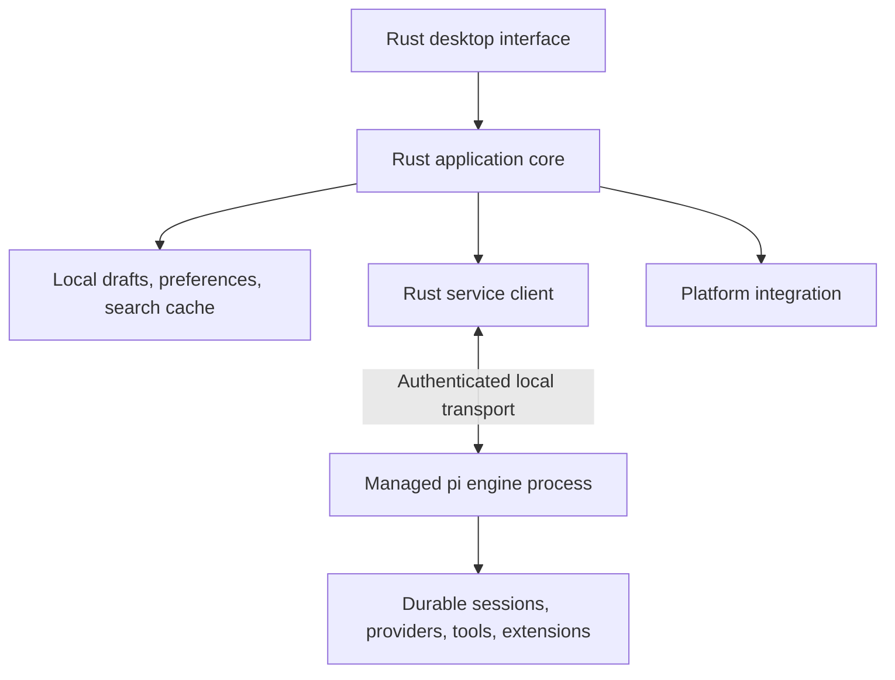

# Rust Desktop Client for Pi

Planning date: 2026-10-03

Status: Proposed plan. Framework selection and visual direction require validation before implementation.

## Recommendation and assumptions

Build a **native Rust desktop client around pi’s existing agent engine**, with a restrained visual identity, excellent text interaction, and recovery designed into every operation.

The recommended starting point is **GPUI for the interface, a framework-independent Rust application core, and pi running in a separate managed process**. Validate GPUI on all three platforms before committing to it.

This plan assumes individual developers working locally first. The desktop interface and application logic would be Rust; pi’s existing TypeScript engine would remain responsible for models, tools, and extensions.

“Near error-less” should become measurable requirements: no silent data loss, no automatic duplication of uncertain operations, understandable failures, and tested recovery.

## 1. Define the product around one complete workflow

The central workflow is:

**Open a project → describe work → understand progress → inspect changes → continue or stop → return later without losing context.**

The interface should always answer:

- Which project and conversation am I working in?
- What is pi doing?
- Does it need something from me?
- What changed?
- What can I safely do next?

Make the first release excellent at that workflow. Include project switching, conversations, streaming responses, tool activity, model selection, attachments, steering, follow-ups, cancellation, search, change inspection, and recovery.

Defer team collaboration, cloud synchronization, an extension marketplace, a full code editor, and an embedded terminal until the core experience meets its quality targets. Provide “Open in editor” and “Open terminal here” early.

## 2. Build on the actual repository, with explicit integration milestones

This checkout already contains useful foundations:

| Existing foundation | Implication for the desktop client |
|---|---|
| JSONL subprocess RPC | Useful for an early interaction prototype |
| Experimental client/server protocol | Better foundation for independently running sessions |
| Durable session runtime | Existing ownership, persistence, and recovery mechanisms |
| Session directory and management services | Starting point for conversation navigation |
| Model and agent-controller services | Existing operations for prompting, steering, follow-ups, and cancellation |
| Replicated transcript state | Starting point for live rendering |

However, the experimental server is currently excluded from published packages and standalone binaries. Its transcript contains active context rather than all historical entries; history paging and several conversation operations remain unfinished. These are backend deliverables, not desktop features that can simply be switched on. See the [service implementation overview](../packages/coding-agent/src/experimental/services/README.md).

Recommended integration strategy:

- Use existing RPC only for a disposable early prototype if it accelerates UI validation.
- Make the durable service architecture the production target.
- Package a tested engine version with the desktop application.
- Establish an explicit desktop service contract and capability negotiation.
- Reject incompatible engines with an actionable message.
- Add support for independently installed engines later, if users need it.

Avoid maintaining two production backends during the first release.

## 3. Select the UI framework through a working prototype

**GPUI is the leading candidate.** Its custom rendering and Rust interface suit a polished developer application. Its current documentation covers macOS, Windows, Wayland, and X11, but also explicitly warns about breaking changes before 1.0. Pin the chosen version or revision. See the [GPUI documentation](https://github.com/zed-industries/zed/tree/main/crates/gpui).

Compare alternatives against the same demanding screen:

| Candidate | Reason to consider it | Main question to resolve |
|---|---|---|
| **GPUI** | Precise custom interface, rich developer-tool interactions | Can the selected revision satisfy the full platform and accessibility matrix? |
| **Iced** | Rust state-driven architecture; GPU and software renderers | Can text interaction, accessibility, and custom components meet the required standard? |
| **Slint** | Declarative interface with documented accessibility semantics | Does its text and document interaction fit this application? |
| **Tauri** | Strong web interface ecosystem with a Rust host | Is a web-based interface acceptable? |

Iced documents both GPU rendering and a software alternative. Slint exposes accessibility roles, properties, and actions. Tauri uses different system webviews across platforms, which adds a browser-engine test matrix. Sources: [Iced](https://github.com/iced-rs/iced), [Slint accessibility](https://docs.slint.dev/latest/docs/slint/reference/common/), and [Tauri webviews](https://v2.tauri.app/reference/webview-versions/).

Give framework validation two weeks. Build a real composer, streaming transcript, searchable conversation list, diff pane, menus, and dialogs.

**Pass criteria:** correct international text input, cross-message selection, keyboard navigation, screen-reader interaction, large transcripts, fractional scaling, suspend/resume, and acceptable rendering on target hardware. A framework that fails an essential requirement does not pass because its screenshots look good.

## 4. Establish a visual direction before expanding the interface

Proposed direction: **a quiet, precise workspace with strong typography and unusually clear information hierarchy**.

The distinguishing features should be the conversation’s readability, the relationship between actions and results, and the quality of every interaction.

Develop three visual studies using identical realistic content. Select one, then record its typography, colors, spacing, component behavior, and motion rules.

The design system should include:

- Equally finished light and dark themes.
- Warm or cool neutral surfaces with one restrained accent.
- Semantic colors for running, waiting, completed, and failed states, always accompanied by text or shape.
- Comfortable reading typography and a coordinated monospace face.
- Consistent spacing, control heights, borders, icons, and focus indicators.
- Short, purposeful transitions with reduced-motion support.
- Standard and compact density settings.
- Long labels, empty states, loading states, and errors designed alongside normal states.

Use native window controls and platform conventions. Keep product structure consistent across platforms without forcing macOS shortcuts or window behavior onto Linux and Windows.

Judge designs with long code blocks, failed tools, missing credentials, narrow windows, and large text—not just an empty conversation.

## 5. Use a simple, adaptable workspace

Organize the main window into three areas:

| Area | Contents | Default behavior |
|---|---|---|
| Navigation | Projects, recent conversations, search | Collapsible; preserves selection |
| Conversation | Messages, grouped tool activity, composer | Primary focus |
| Inspector | Changes, files, run details | Opens when relevant or requested |

Narrow windows show the conversation with navigation and inspection available as temporary panels. Wide windows support simultaneous conversation and diff review. Avoid a large minimum width that makes the app awkward in a tiled desktop.

Keep settings out of the primary workflow. Put model selection near the composer, with advanced configuration available on demand.

Use one action registry for menus, command search, buttons, and shortcuts. Each action has the same availability rules and explanation everywhere. Keybindings remain configurable.

Search results should distinguish projects, conversations, and messages. Opening a result should reveal its context and provide a predictable way back.

## 6. Make the composer and transcript exceptional

These are the most frequently used components and deserve disproportionate engineering effort.

### Composer requirements

- Multiline editing, undo/redo, selection, and configurable send behavior.
- Correct input-method composition for languages such as Chinese and Japanese.
- File references and attachment previews with clear size/type errors.
- Persistent drafts per conversation.
- Discoverable slash commands.
- Explicit controls for “Steer current work” and “Queue follow-up.”
- Clear distinction between queued, submitted, accepted, and completed.
- Draft preservation when sending fails.

### Transcript requirements

- Render only visible content while preserving selection and accessibility.
- Incremental Markdown and syntax highlighting.
- Stable scroll position while new content arrives.
- Follow new output only when the user is already following it.
- A visible “Jump to latest” control.
- Tool summaries that expand into inputs, output, timing, and errors.
- Searchable historical content, including content before compaction.
- Bounded rendering of extremely large outputs with an option to inspect the complete result.

For example, scrolling upward to inspect an earlier command must never be interrupted by new tokens pulling the viewport downward.

Change inspection must distinguish **workspace changes** from **changes attributable to a particular run**. Until attribution exists, label the former honestly. Do not provide an “Undo run” action without reliable snapshots and conflict handling.

## 7. Separate presentation, application state, and execution

Use the following architecture:

The application core should remain independent of GPUI. It owns commands, state transitions, reconciliation, and presentation models. Rendering components should not directly spawn processes, mutate session storage, or interpret transport frames.

Suggested Rust workspace boundaries:

- `pipkin-app`: application entry point and composition.
- `pipkin-ui`: screens and reusable components.
- `pipkin-core`: commands and state machines.
- `pi-client`: protocol and service bindings.
- `desktop-storage`: drafts, preferences, and disposable indexes.
- `desktop-platform`: windows, credentials, dialogs, notifications, and process lifecycle.
- `desktop-test-support`: fake engine, fixtures, and fault injection.

Start with fewer crates if boundaries are not yet meaningful. Avoid creating a generic plugin framework or dependency container before there is a concrete need.

Use bounded asynchronous work queues. Keep filesystem access, decoding, indexing, and large text processing off the UI thread.

## 8. Treat the service contract as a first-class deliverable

The current protocol uses framed CBOR envelopes, while Chord owns service calls, subscriptions, snapshots, and state updates. Implementing the envelope alone will not produce a working Rust client. See the [protocol overview](../packages/protocol/README.md).

The Rust client needs a deliberately bounded implementation of those service semantics, tested against the TypeScript implementation.

Required contract work includes:

- Protocol and application-service version checks.
- Capability discovery.
- Typed requests, responses, and errors.
- Snapshot hydration before applying incremental updates.
- Detection of missing, stale, or invalid updates.
- Reattachment and resynchronization.
- Stable request identity and operation-status lookup.
- Historical transcript paging.
- Project directory, conversation title, and activity metadata.
- Provider authentication operations.
- Explicit extension interaction capabilities.

Generate cross-language fixtures from shared schemas where practical. Test integer boundaries, Unicode, nullability, malformed payloads, frame fragmentation, and resource limits.

Preserve the existing server/session/attachment identity checks. A delayed response from one conversation must never update another.

## 9. Design recovery around uncertain outcomes

The hardest failure is not “request failed.” It is:

**The user sends a prompt → pi accepts it → the connection drops before the acknowledgment arrives.**

Blindly retrying may start the work twice. The current client documentation explicitly says disconnected requests may still complete and are not automatically replayed. See the [client behavior](../packages/client/README.md).

The production design should:

- Persist a client-generated request ID before sending.
- Have the engine durably deduplicate that ID within a defined scope.
- Return the existing operation when the same request is repeated.
- Allow the client to query its status after reconnecting.
- Keep an explicit “Outcome unknown” state until reconciliation succeeds.

Request deduplication does **not** guarantee exactly-once external tool effects. A shell command may partially execute before crashing. Recovery must distinguish replay-safe work from work requiring inspection.

Define separate connection, operation, and persistence states. Avoid a single collection of flags such as `loading`, `busy`, and `error`.

| Failure | Required behavior |
|---|---|
| Interface crash | Restore drafts and reconnect to surviving work |
| Engine crash | Restart within limits; inspect durable state before continuing |
| Connection loss | Preserve content, show connection state, reconcile before retrying |
| Provider throttling | Explain the wait; display engine retry status |
| Disk full | Stop claiming content is saved; preserve memory state and offer export |
| Invalid update | Discard the replica and request a fresh snapshot |
| Cancellation delay | Show “Stopping” until the engine confirms settlement |
| Repeated crash | Enter recovery mode with diagnostics and optional features disabled |
| Interrupted update | Keep a bootable previous application version |

Backoff and retries need ceilings. Recovery must not become an invisible restart loop.

## 10. Make persistence ownership unambiguous

Pi owns authoritative conversations and execution state. The desktop owns drafts, layout, preferences, and rebuildable search caches.

Never let the desktop write directly into a session database that an engine worker owns.

For desktop persistence:

- Use transactional writes and a single coordinated writer.
- Apply versioned migrations with tested failure handling.
- Back up data before destructive migrations.
- Debounce draft saves with a bounded interval and flush on relevant lifecycle events.
- Display a save failure when persistence fails.
- Rebuild derived caches instead of treating them as authoritative.

Define separate guarantees for process crashes and power loss. The durable runtime documents that its SQLite configuration may lose the newest commits on host or power failure; stronger promises require storage changes and corresponding tests. See the [durable storage documentation](../packages/durable/README.md).

Application rollback and database rollback must be designed together. An older binary must not open an incompatible migrated database.

## 11. Preserve pi’s extension model without overstating compatibility

Pi extensions are a major product feature. Keep engine-side extensions in the engine process.

Map supported interactions into native controls:

- Selection, confirmation, text input, and multiline editing.
- Notifications and status messages.
- Structured tool output.
- Commands exposed through a defined desktop presentation contract.

Terminal-specific custom interfaces do not automatically translate into desktop widgets. Existing RPC explicitly degrades or omits several terminal UI methods. See the [extension UI limitations](../packages/coding-agent/docs/rpc-extension-ui.md).

Publish a compatibility matrix and show unsupported capabilities clearly. A plugin requiring an unsupported interaction must not leave the application waiting indefinitely.

Avoid loading arbitrary extension code into the Rust interface process. Add richer desktop extension surfaces only after the initial presentation contract proves sufficient.

## 12. Make platform support an acceptance matrix

“Cross-platform” must mean tested installations and daily workflows.

| Platform | Required coverage |
|---|---|
| Omarchy/Arch | Hyprland/Wayland, tiled resizing, fractional scaling, portals, clipboard, notifications, missing keyring, Intel/AMD/NVIDIA |
| Other Linux | GNOME Wayland, KDE Wayland, an X11 configuration, declared distribution/library baseline |
| Windows | Native process management, named-pipe authentication, Unicode/long paths, per-monitor DPI, sleep/resume, signed installer |
| macOS | Apple Silicon, declared Intel support policy, native menus, Keychain, VoiceOver, signing and notarization |

Additional requirements:

- Test drag-and-drop, external editor launching, and opening folders on every platform.
- Detect missing development tools with specific remedies.
- Define how the engine receives environment variables when launched from a desktop icon.
- Do not depend on an interactive shell startup file executing successfully.
- Support meaningful read-only/offline access to existing conversations and drafts.
- Distinguish native Windows projects from any future WSL integration.
- Use explicit process ownership so closing a window and quitting the engine have predictable behavior.

On Linux, provide a maintained Arch package definition plus a practical distribution format for other supported systems. Validate sandboxed packaging separately because it changes project and tool access.

## 13. Build trust and accessibility into normal use

Pi currently runs with its host process’s permissions; it does not supply a built-in filesystem/process/network permission boundary. See the [repository documentation](../README.md).

The desktop should therefore:

- Authenticate local connections.
- Use restrictive socket permissions or named-pipe access controls.
- Keep provider credentials in an appropriate secure store or the engine’s established credential mechanism.
- Explain the execution environment accurately.
- Enforce any promised isolation in the execution layer.
- Treat generated Markdown, links, file paths, and tool output as untrusted content.
- Avoid automatically fetching remote images embedded in responses.
- Redact credentials and sensitive content from diagnostics.

Accessibility is a release gate: complete keyboard operation, visible focus, scalable text, high contrast, reduced motion, and tested screen-reader workflows.

GPUI currently documents AccessKit integration, but the application still must provide correct roles, stable identities, labels, and actions. Framework support is only the starting point. See the [GPUI accessibility implementation](https://github.com/zed-industries/zed/blob/main/crates/gpui/src/_accessibility.rs).

## 14. Set measurable quality targets

Establish reference machines and datasets during the prototype. These are proposed targets, not benchmark claims:

| Area | Initial acceptance target |
|---|---|
| Warm launch | Usable interface within 1 second |
| Cold launch | Usable interface within 2.5 seconds, independent of provider availability |
| Input responsiveness | p95 input-to-paint below 50 ms |
| Scrolling | p95 frame time within a 60 Hz frame budget on reference hardware |
| Large history | Responsive navigation through a 10,000-message paged fixture |
| Memory | Initial desktop-process budget below 250 MB on a defined idle fixture; measure engine separately |
| Draft recovery | No acknowledged saved draft lost in the crash test matrix |
| Duplicate submission | No duplicate operation acceptance in disconnect/retry tests |
| Stability | Target at least 99.9% crash-free launches during a sufficiently sized beta |
| Usability | At least 90% unassisted completion of core tasks in representative testing |

Monitor bounded memory under long streams, not only idle memory. Establish separate limits for attachment decoding, output buffering, and search indexes.

Measure reliability through consented diagnostics and controlled testing. Do not collect prompts, code, or tool output by default.

## 15. Use a test strategy that attacks failure boundaries

Build the fake engine and fault controls alongside the first working client.

Required layers:

- **Core tests:** state transitions, command availability, reconciliation, cancellation, and persistence.
- **Protocol conformance:** Rust and TypeScript exchange the same valid and invalid fixtures.
- **Property tests and fuzzing:** framing, decoding, state updates, and malformed content.
- **Process tests:** kill either process before and after acknowledgment, during persistence, and during reconnect.
- **Storage tests:** disk full, migration interruption, corruption, and backup restoration.
- **Interface tests:** keyboard, focus, selection, large text, theme changes, and stable scrolling.
- **Native platform tests:** real installers, real window systems, real screen readers, and representative GPUs.
- **Soak tests:** long-running sessions, repeated attach/detach, large outputs, and many project switches.

Use deterministic fake providers in routine CI. Keep any live-provider verification separate and explicitly controlled.

Run the repository’s required checks for TypeScript changes, and Rust formatting, linting, unit, integration, and platform checks for the client. Make severe data-loss, security, accessibility, and recovery defects release blockers.

## 16. Deliver through milestones with exit criteria

For roughly four experienced engineers, a product designer, and dedicated platform QA capacity, budget **six to nine months** for the stated quality level. Re-estimate after the framework and protocol spikes.

| Phase | Approximate duration | Exit criterion |
|---|---|---|
| Product and technical validation | 2–3 weeks | Framework decision, visual studies, platform results, protocol gap list |
| Runtime and contract foundation | 4–6 weeks | Packaged engine, authenticated transport, typed client, recovery harness |
| Complete working workflow | 4–5 weeks | Open project, prompt, inspect tools, cancel, close, reopen |
| Product depth and visual system | 5–7 weeks | History, search, attachments, changes, settings, supported extension UI |
| Resilience and platform hardening | 5–7 weeks | Fault matrix, accessibility, installers, upgrades, performance gates |
| Private beta and release preparation | 4–6 weeks | Usability targets, stable recovery, support documentation, release evidence |

Some design and platform work can overlap. Do not defer Windows, accessibility, or recovery until the final phase.

Maintain separate ownership for interface quality, engine/protocol integration, and platform/reliability work. Each milestone should produce something installable and reviewable.

## 17. Start with these concrete deliverables

The first ten working days should produce:

1. A product brief covering users, primary workflows, release scope, and exclusions.
2. Three visual studies using realistic pi transcripts and failure states.
3. One working GPUI prototype on Omarchy/Arch, Windows, and macOS.
4. A framework scorecard covering text, accessibility, graphics, and packaging.
5. A desktop service contract proposal with the current backend gaps identified.
6. A Rust client exchanging real messages with pi.
7. A failure demonstration: disconnect after submission and recover without blindly resending.
8. A measured performance baseline and platform support matrix.
9. An implementation backlog ordered by dependency and risk.
10. Architecture decisions documenting framework choice, process lifecycle, persistence ownership, and update strategy.

The first milestone is complete when **the proposed interface feels excellent on every target platform and the integration can recover honestly from an interrupted operation**.
